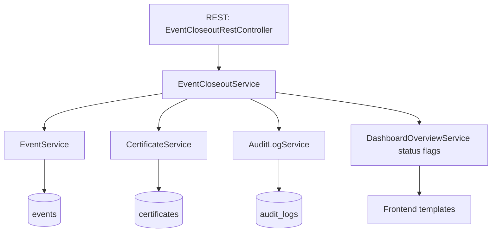
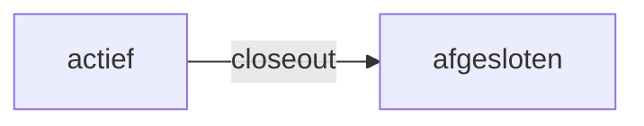
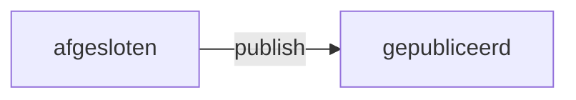
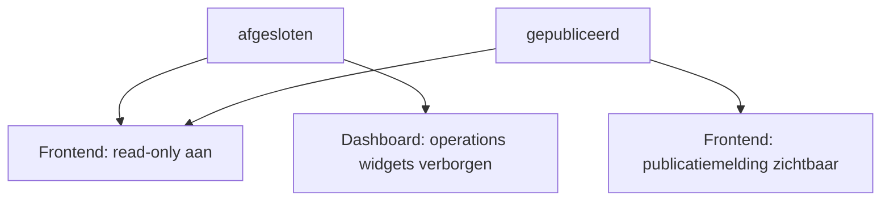
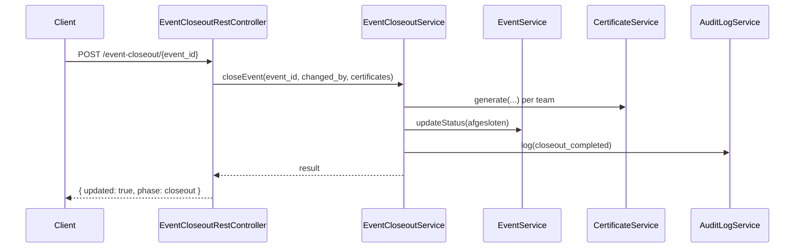
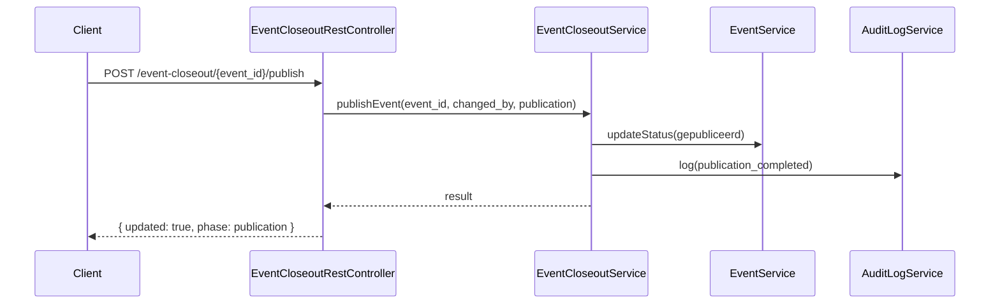

# Dagafsluiting - Complete MVP Flow

Status: 8 juli 2026

Dit document beschrijft de volledige dagafsluitingsflow zoals die nu in de codebase is geïmplementeerd voor MVP, inclusief triggers, statusovergangen, read-only/publicatiegedrag en validatie.

## Doel

Een event gecontroleerd afronden en publiceren via een reproduceerbare flow met:
- expliciete statusovergangen
- certificaatregistratie
- audit logging
- frontend read-only/publicatiegedrag
- persisted publicatiebron voor top-3/eindstand
- template/outbox notificatieketen met retries

## Scope van de huidige implementatie

In scope (af):
- closeout-orchestratie via service-laag
- REST-trigger voor closeout
- REST-trigger voor publicatie
- REST-read endpoint voor persisted publicatieresultaat
- admin lifecycle-UI voor closeout/publicatie
- CLI lifecycle-actie voor closeout/publicatie
- audit logging voor closeout en publicatie
- geconcretiseerde publicatiepayload (top-3 + eindstand)
- publicatienotificatieflow op basis van recipients
- email templatebeheer + outbox + retry-processing
- frontend weergave voor read-only en gepubliceerd
- geautomatiseerde tests op service- en REST-niveau

Nog niet in scope:
- definitieve podium- en eindstandberekening
- operationele rapportage op notificatiedelivery en foutpercentages

## Kerncomponenten

- Orchestratie: `src/Service/EventCloseoutService.php`
- Persisted publicatiebron: `src/Service/EventPublicationService.php`
- Statusmutaties: `src/Service/EventService.php`
- Certificaatregistratie: `src/Service/CertificateService.php`
- Audit logging: `src/Service/AuditLogService.php`
- REST-trigger: `src/Api/EventCloseoutRestController.php`
- Notificatieketen: `src/Service/PublicationNotificationService.php`, `src/Service/EmailTemplateService.php`, `src/Service/EmailOutboxService.php`, `src/Service/OutboxProcessorService.php`
- Plugin wiring: `src/Core/Plugin.php`



## Statusovergangen

1. Active event -> `afgesloten` (closeout)
2. `afgesloten` -> `gepubliceerd` (publicatie)







Resultaat op frontend:
- `afgesloten`: read-only melding zichtbaar, operationele dashboardwidgets verborgen
- `gepubliceerd`: read-only melding plus publicatiemelding zichtbaar

## REST Triggers

### 1. Closeout

Endpoint:
- `POST /wp-json/bso-survival/v1/event-closeout/{event_id}`

Body:

```json
{
	"changed_by": "wedstrijdleiding",
	"certificates": [
		{
			"team_id": 5,
			"file_path": "/tmp/team-5.pdf",
			"meta": {
				"position": 1
			}
		}
	]
}
```

Effect:
- eventstatus naar `afgesloten`
- certificaatrecords aangemaakt
- auditlog met action `closeout_completed`



### 2. Publicatie

Endpoint:
- `POST /wp-json/bso-survival/v1/event-closeout/{event_id}/publish`

Body:

```json
{
	"changed_by": "wedstrijdleiding",
	"publication": {
		"headline": "Uitslag gepubliceerd"
	}
}
```

Effect:
- eventstatus naar `gepubliceerd`
- publicatiepayload genormaliseerd (`headline`, `published_at`, `top_3`, `final_standings`, `recipients`)
- persisted publicatieresultaat opgeslagen als bron van waarheid
- notificatieketen uitgevoerd (template -> outbox -> processor)
- auditlog met action `publication_completed`

### 3. Persisted publicatieresultaat ophalen

Endpoint:
- `GET /wp-json/bso-survival/v1/event-closeout/{event_id}/publication`

Effect:
- levert actuele persisted publicatie (`headline`, `published_at`, `top_3`, `final_standings`) voor admincontrole
- gebruikt door lifecycle admin voor handmatige refresh en auto-refresh na publish



### Autorisatie

- capability: `manage_options`
- geldige REST nonce (`X-WP-Nonce`)

## Compacte Admin Handleiding

Deze handleiding is bedoeld voor snelle, veilige uitvoering van dagafsluiting in de admin.

Locatie:
- WordPress admin -> `BSO Rules` -> `Event Lifecycle`

### Snelle closeout-flow

1. Kies het juiste event bovenaan de pagina.
2. Vul `Changed by` in (standaard staat huidige beheerder).
3. Klik `Voorbeeld closeout laden` of plak eigen `Certificates JSON`.
4. Klik `JSON valideren`.
5. Klik `Event afsluiten (closeout)` en bevestig de popup.
6. Controleer `Laatste response` op `phase=closeout` en `status=afgesloten`.

### Snelle publicatie-flow

1. Vul `Publicatie headline` in.
2. Vul optioneel `Published at` in (ISO-8601).
3. Klik `Voorbeeld publicatie laden` of plak eigen `Standings JSON`.
4. Controleer `Publicatie preview` (aantal + top 3).
5. Zet `Notificaties versturen bij publicatie` aan/uit.
6. Voeg optioneel recipients toe (komma, puntkomma of nieuwe regel gescheiden).
7. Klik `JSON valideren`.
8. Klik `Event publiceren` en bevestig de popup.
9. Controleer `Laatste response` op `phase=publication`, `status=gepubliceerd`, `publication.top_3` en `publication.final_standings`.

### Verwachte minimum-JSON

Certificates JSON (closeout):

```json
[
	{
		"team_id": 5,
		"file_path": "/tmp/team-5.pdf",
		"meta": { "position": 1 }
	}
]
```

Standings JSON (publicatie):

```json
[
	{ "rank": 1, "team_id": 11, "team_name": "Team Rood", "points": 98.5 },
	{ "rank": 2, "team_id": 22, "team_name": "Team Blauw", "points": 96.25 },
	{ "rank": 3, "team_id": 33, "team_name": "Team Groen", "points": 92.75 }
]
```

### CLI alternatief (beheer/automation)

Closeout:

```bash
wp bso-survival lifecycle --phase=closeout --event_id=14 --changed_by=wedstrijdleiding --certificates='[{"team_id":5,"file_path":"/tmp/team-5.pdf"}]'
```

Publicatie:

```bash
wp bso-survival lifecycle --phase=publish --event_id=14 --changed_by=wedstrijdleiding --publication='{"headline":"Uitslag gepubliceerd","standings":[{"rank":1,"team_id":11,"team_name":"Team Rood","points":98.5}],"recipients":["coach@example.test"]}'
```

### Snelle foutcheck

- `JSON validatie faalt`: controleer op array-structuur in certificates/standings.
- `403/nonce fout`: vernieuw de adminpagina en probeer opnieuw.
- `changed_by is verplicht`: vul een niet-lege waarde in.
- `notifications.failed_count > 0`: controleer recipient-adressen en mailconfiguratie van WordPress.

## Hook Contract

Closeout:
- `bso_survival_before_event_closeout`
- `bso_survival_event_closed_out`

Publicatie:
- `bso_survival_before_event_publication`
- `bso_survival_event_published`

Audit:
- `bso_survival_before_audit_log_write`
- `bso_survival_audit_log_written`
- `bso_survival_audit_log_failed`

Volledige referentie: `docs/hooks-and-filters.md`

## Frontend Gedrag

Read-only/publicatiegedrag is nu expliciet verwerkt in:
- `templates/frontend-dashboard.php`
- `templates/frontend-event-overview.php`
- `templates/frontend-event-summary.php`

Bij `is_read_only=true`:
- melding dat event read-only is afgesloten
- operationele widgets in dashboard worden niet gerenderd

Bij `is_published=true`:
- extra melding dat eindstand gepubliceerd is

## Implementatiechecklist (afgerond)

- [x] Service-orchestratie voor closeout
- [x] Service-orchestratie voor publicatie
- [x] REST-trigger voor closeout
- [x] REST-trigger voor publicatie
- [x] Frontend read-only/publicatieflow
- [x] Hookcontract gedocumenteerd
- [x] Testdekking voor service + trigger + frontendweergave

## Testdekking

Belangrijkste tests:
- `tests/Service/EventCloseoutServiceTest.php`
- `tests/Service/EventCloseoutRestControllerTest.php`
- `tests/Service/DashboardControllerTest.php`
- `tests/Service/EventOverviewControllerTest.php`
- `tests/Service/EventSummaryControllerTest.php`

Huidige testsuite:
- `OK (112 tests, 316 assertions)`

## Acceptatiecriteria

De dagafsluiting-MVP is correct als:
- closeout-route een event daadwerkelijk naar `afgesloten` zet
- publish-route een event daadwerkelijk naar `gepubliceerd` zet
- beide stappen audit logging schrijven
- frontend read-only/publicatie zichtbaar maakt op overzichtsschermen
- alle relevante tests groen blijven

## Vervolg na MVP

Aanbevolen volgende uitbreidingen:
- podium- en eindstandberekening koppelen aan rankingservice i.p.v. handmatige standings-input
- communicatieflow uitbouwen met beheerde templates + outbox/retry
- operationele rapportage toevoegen op notification success/failure ratio
