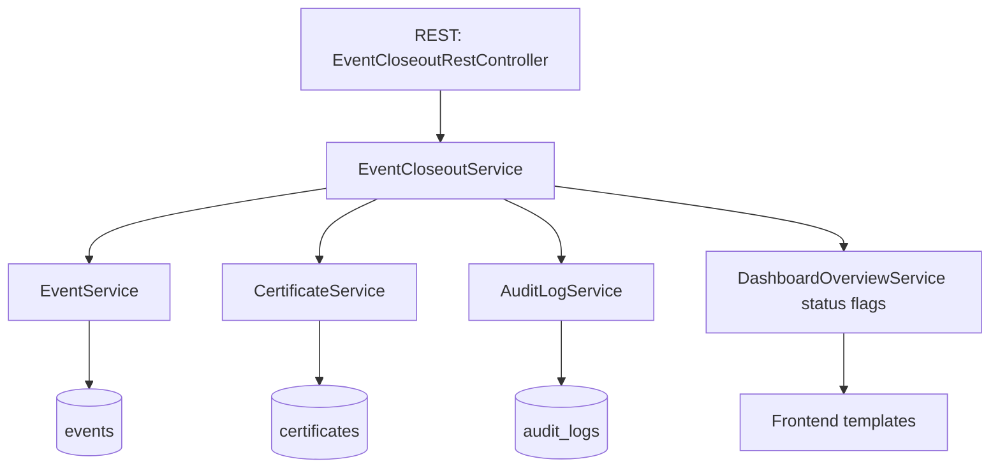
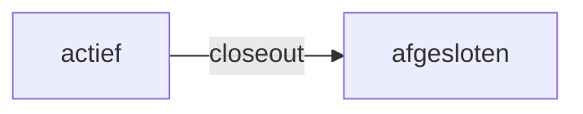
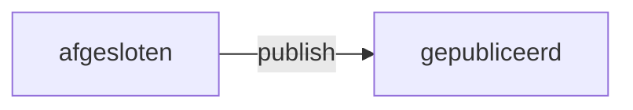
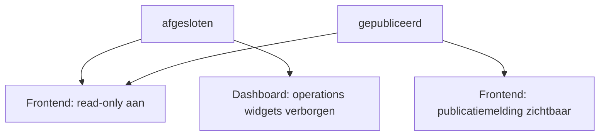
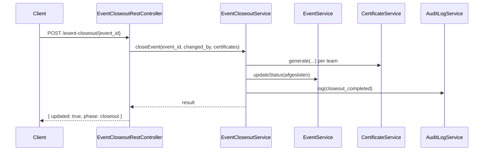
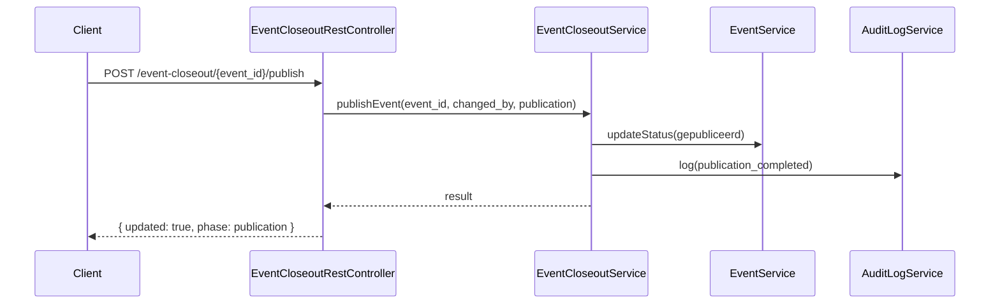

# Dagafsluiting - Complete MVP Flow

Status: 8 juli 2026

Dit document beschrijft de volledige dagafsluitingsflow zoals die nu in de codebase is geïmplementeerd voor MVP, inclusief triggers, statusovergangen, read-only/publicatiegedrag en validatie.

## Doel

Een event gecontroleerd afronden en publiceren via een reproduceerbare flow met:
- expliciete statusovergangen
- certificaatregistratie
- audit logging
- frontend read-only/publicatiegedrag

## Scope van de huidige implementatie

In scope (af):
- closeout-orchestratie via service-laag
- REST-trigger voor closeout
- REST-trigger voor publicatie
- audit logging voor closeout en publicatie
- frontend weergave voor read-only en gepubliceerd
- geautomatiseerde tests op service- en REST-niveau

Nog niet in scope:
- definitieve podium- en eindstandberekening
- notificatie/communicatie na publicatie (mail/bericht)
- dedicated admin-UI voor closeout/publicatieknoppen

## Kerncomponenten

- Orchestratie: `src/Service/EventCloseoutService.php`
- Statusmutaties: `src/Service/EventService.php`
- Certificaatregistratie: `src/Service/CertificateService.php`
- Audit logging: `src/Service/AuditLogService.php`
- REST-trigger: `src/Api/EventCloseoutRestController.php`
- Plugin wiring: `src/Core/Plugin.php`



## Statusovergangen

1. Active event -> `afgesloten` (closeout)
2. `afgesloten` -> `gepubliceerd` (publicatie)







Resultaat op frontend:
- `afgesloten`: read-only melding zichtbaar, operationele dashboardwidgets verborgen
- `gepubliceerd`: read-only melding plus publicatiemelding zichtbaar

## REST Triggers

### 1. Closeout

Endpoint:
- `POST /wp-json/bso-survival/v1/event-closeout/{event_id}`

Body:

```json
{
	"changed_by": "wedstrijdleiding",
	"certificates": [
		{
			"team_id": 5,
			"file_path": "/tmp/team-5.pdf",
			"meta": {
				"position": 1
			}
		}
	]
}
```

Effect:
- eventstatus naar `afgesloten`
- certificaatrecords aangemaakt
- auditlog met action `closeout_completed`



### 2. Publicatie

Endpoint:
- `POST /wp-json/bso-survival/v1/event-closeout/{event_id}/publish`

Body:

```json
{
	"changed_by": "wedstrijdleiding",
	"publication": {
		"headline": "Uitslag gepubliceerd"
	}
}
```

Effect:
- eventstatus naar `gepubliceerd`
- auditlog met action `publication_completed`



### Autorisatie

- capability: `manage_options`
- geldige REST nonce (`X-WP-Nonce`)

## Hook Contract

Closeout:
- `bso_survival_before_event_closeout`
- `bso_survival_event_closed_out`

Publicatie:
- `bso_survival_before_event_publication`
- `bso_survival_event_published`

Audit:
- `bso_survival_before_audit_log_write`
- `bso_survival_audit_log_written`
- `bso_survival_audit_log_failed`

Volledige referentie: `docs/hooks-and-filters.md`

## Frontend Gedrag

Read-only/publicatiegedrag is nu expliciet verwerkt in:
- `templates/frontend-dashboard.php`
- `templates/frontend-event-overview.php`
- `templates/frontend-event-summary.php`

Bij `is_read_only=true`:
- melding dat event read-only is afgesloten
- operationele widgets in dashboard worden niet gerenderd

Bij `is_published=true`:
- extra melding dat eindstand gepubliceerd is

## Implementatiechecklist (afgerond)

- [x] Service-orchestratie voor closeout
- [x] Service-orchestratie voor publicatie
- [x] REST-trigger voor closeout
- [x] REST-trigger voor publicatie
- [x] Frontend read-only/publicatieflow
- [x] Hookcontract gedocumenteerd
- [x] Testdekking voor service + trigger + frontendweergave

## Testdekking

Belangrijkste tests:
- `tests/Service/EventCloseoutServiceTest.php`
- `tests/Service/EventCloseoutRestControllerTest.php`
- `tests/Service/DashboardControllerTest.php`
- `tests/Service/EventOverviewControllerTest.php`
- `tests/Service/EventSummaryControllerTest.php`

Huidige testsuite:
- `OK (111 tests, 299 assertions)`

## Acceptatiecriteria

De dagafsluiting-MVP is correct als:
- closeout-route een event daadwerkelijk naar `afgesloten` zet
- publish-route een event daadwerkelijk naar `gepubliceerd` zet
- beide stappen audit logging schrijven
- frontend read-only/publicatie zichtbaar maakt op overzichtsschermen
- alle relevante tests groen blijven

## Vervolg na MVP

Aanbevolen volgende uitbreidingen:
- podium- en eindstandberekening koppelen aan publicatiepayload
- admin-UI voor closeout/publicatie toevoegen
- communicatieflow na publicatie (mail/bericht) toevoegen
