# Functioneel Ontwerp v2 - BSO Survival

> Statusnotitie 7 juli 2026: de read-only shortcode-laag uit dit ontwerp is nu deels operationeel met dashboard, onderdelen, teams, gecombineerd overzicht en compacte overzichtsvariant.

## Inhoudsopgave

1. [Visie en uitgangspunten](#1-visie-en-uitgangspunten)
2. [Doelgroepen en rollen](#2-doelgroepen-en-rollen)
3. [User Story gebaseerde scope](#3-user-story-gebaseerde-scope)
4. [Architectuur volgens WordPress best practice](#4-architectuur-volgens-wordpress-best-practice)
5. [Datamodel](#5-datamodel)
6. [Dagplanning en roosteroptimalisatie](#6-dagplanning-en-roosteroptimalisatie)
7. [Belangrijkste workflows](#7-belangrijkste-workflows)
8. [Dashboard en mobiele ervaring](#8-dashboard-en-mobiele-ervaring)
9. [Beheer, score-invoer en onderdeelconfiguratie](#9-beheer-score-invoer-en-onderdeelconfiguratie)
10. [Meldingen, communicatie en certificaten](#10-meldingen-communicatie-en-certificaten)
11. [Berekeningen en statuslogica](#11-berekeningen-en-statuslogica)
12. [Beveiliging en toegang](#12-beveiliging-en-toegang)
13. [MVP, doorontwikkeling en acceptatiecriteria](#13-mvp-doorontwikkeling-en-acceptatiecriteria)

---

## 1. Visie en uitgangspunten

BSO Survival v2 is een WordPress plugin die de volledige survivaldag ondersteunt: van teaminschrijving tot dagplanning, scoreverwerking, live dashboard en afsluiting met eindstand en certificaten.

### Kernvisie

- De organisatie kan de survivaldag vooraf inplannen op basis van bekende teams en onderdelen.
- Scheidsrechters kunnen per tijdslot snel en foutarm scores registreren, inclusief jokergebruik.
- Ouders en teamleden kunnen op mobiel realtime zien wat al is gedaan, wat nog komt en hoe het team ervoor staat.
- Leiding en beheer hebben live overzicht op voortgang, meldingen en operationele uitzonderingen.

### Randvoorwaarden

- Teaminschrijving sluit voordat de dagplanning wordt berekend.
- Maximaal aantal teams per survivaldag: configureerbaar in admin (standaard 22).
- Maximaal aantal onderdelen per survivaldag: configureerbaar in admin (standaard 20).
- Wisseltijd tussen tijdsloten: configureerbaar in admin (standaard 5 minuten).
- Standaard actieve duur van een survival onderdeel: configureerbaar in admin (standaard 20 minuten).
- Standaard uitleg/instructietijd door scheidsrechters: configureerbaar in admin (standaard 5 minuten).
- Standaard rondeduur: berekend uit uitleg + actief + wissel (standaard 30 minuten).
- Start en einde van ieder tijdslot worden centraal door leiding gesignaleerd.

### Ontwerpprincipes

| Principe | Betekenis |
|---|---|
| Mobile first | Kernfunctionaliteit werkt op telefoon zonder extra handelingen |
| User story driven | Scope, backlog en implementatie volgen concrete gebruikersbehoeften |
| Operationeel betrouwbaar | Validatie, fallback en statusbewaking voorkomen verstoring op de dag |
| Uitbreidbaar | Plannings-, score-, dashboard- en communicatiemodules blijven los koppelbaar |
| WordPress native | Rollen, capabilities, REST API en admin-structuur volgen WP-conventies |

---

## 2. Doelgroepen en rollen

| Rol | Context | Primaire taak | Device |
|---|---|---|---|
| Vrijwilliger (ouder) | Teamcontact en begeleider | Team inschrijven, planning volgen, uitleg en route openen | Mobiel |
| Teamlid | Frontend bezoeker | Tussenstand, onderdeelresultaten en huidige positie bekijken | Mobiel |
| Scheidsrechter | Ingelogde medewerker | Aanwezigheid controleren, score invoeren, joker registreren, meldingen plaatsen | Mobiel |
| Leiding | Coördinator | Dagvoortgang sturen, fallback-score invoeren, scheidsrechterwissels autoriseren | Mobiel/laptop |
| Beheerder | WordPress admin | Survival plannen, onderdelen configureren, dashboard beheren, dag afsluiten | Laptop |

### Functionele rechten

| Functie | Vrijwilliger | Teamlid | Scheidsrechter | Leiding | Beheerder |
|---|---:|---:|---:|---:|---:|
| Team inschrijven | ja | nee | nee | nee | ja |
| Tussenstand en planning bekijken | ja | ja | ja | ja | ja |
| Score invoeren | nee | nee | ja | ja | ja |
| Joker registreren | nee | nee | ja | ja | ja |
| Teamcompleetheid controleren | nee | nee | ja | ja | ja |
| Onderdelen beheren | nee | nee | nee | nee | ja |
| Meldingen beheren/bewerken | nee | nee | beperkt | ja | ja |
| Survivaldag sluiten | nee | nee | nee | nee | ja |

---

## 3. User Story gebaseerde scope

De v2-scope is geordend in epics. Dubbele user stories zijn samengevoegd tot eenduidige functionele items.

### Epic A - Inschrijving en voorbereiding

**US-A1 - Team inschrijven door vrijwilliger (ouder)**

Als vrijwilliger (ouder) wil ik een team kunnen inschrijven zodat we mee kunnen doen aan de survival.

Acceptatiecriteria:
- Een team bevat teamnaam, contactpersoon, mobiel nummer, e-mailadres.
- Een team bevat maximaal 8 teamleden met alleen naam.
- Inschrijving kan alleen zolang de inschrijfperiode open staat.

**US-A2 - Inschrijfperiode beheren**

Als beheerder wil ik de inschrijfperiode kunnen openen en sluiten zodat duidelijk is wanneer teams nog mogen worden toegevoegd.

Acceptatiecriteria:
- Statussen: open, gesloten.
- Bij gesloten inschrijving zijn nieuwe inschrijvingen geblokkeerd.
- Sluiten van inschrijving is een voorwaarde voor dagplanning.

### Epic B - Dagplanning en toewijzing

**US-B1 - Nieuw Survival Event aanmaken in Admin**

Als beheerder wil ik in de Admin een nieuw Survival Event kunnen aanmaken zodat een nieuwe wedstrijddag als aparte entiteit beheerd kan worden.

Acceptatiecriteria:
- In Admin is een expliciete actie beschikbaar om een nieuw event aan te maken.
- Een event bevat minimaal naam, datum en status.
- Nieuw aangemaakte events zijn direct selecteerbaar in beheerpagina's (dashboard widgets, lifecycle, inschrijvingen).

**US-B1a - Bestaande parts koppelen aan nieuw event**

Als beheerder wil ik na het aanmaken van een event bestaande Survival parts aan dat event kunnen koppelen zodat parts herbruikbaar zijn over meerdere events.

Acceptatiecriteria:
- Koppelen gebruikt bestaande part-definities, zonder duplicaten te maken.
- Een event kan meerdere bestaande parts bevatten.
- Na koppeling zijn de parts zichtbaar in event-overzicht en planning context.

**US-B1b - Gesloten events niet meer wijzigbaar**

Als beheerder wil ik dat gesloten events niet meer aangepast kunnen worden zodat historische resultaten niet per ongeluk worden gewijzigd.

Acceptatiecriteria:
- Voor events met status gesloten/read-only zijn mutaties geblokkeerd.
- Alleen de samenvatting/eindresultaat van gesloten events blijft beschikbaar voor raadpleging.
- Details over opbouw (parts, tussenstanden, scoredetails) hoeven na samenvatting niet meer wijzigbaar of leidend te zijn.

**US-B1c - Event verwijderen zonder part-verlies**

Als beheerder wil ik een event kunnen verwijderen zonder gekoppelde parts te verwijderen zodat andere events dezelfde parts kunnen blijven gebruiken.

Acceptatiecriteria:
- Verwijderen van een event verwijdert geen part-definities.
- Parts blijven beschikbaar voor koppeling aan andere events.
- Verwijderactie geeft duidelijke waarschuwing over wat wel en niet verwijderd wordt.

**US-B1d - Nieuwe survival inplannen**

Als beheerder wil ik een nieuwe survival kunnen inplannen zodat het dagprogramma bekend is en onderdelen per tijdslot score-invoer kunnen ontvangen.

Acceptatiecriteria:
- Planning kan alleen starten als teams en onderdelen voor het event definitief zijn gekoppeld.
- Planning houdt rekening met maxima: 22 teams, 20 onderdelen.
- Per tijdslot is zichtbaar welke teams bij welk onderdeel staan.

**US-B2 - Optimalisatie van teamtegenstanders**

Als beheerder wil ik dat de planning teams zo eerlijk mogelijk verdeelt zodat teams zoveel mogelijk tegen verschillende teams strijden.

Acceptatiecriteria:
- Primair patroon: 2 teams per onderdeel per tijdslot.
- Uitzondering toegestaan: 1 team bij een onderdeel als planning dat vereist.
- Algoritme minimaliseert herhaalde team-tegen-team combinaties.

**US-B3 - Scheidsrechterbezetting per onderdeel**

Als beheerder wil ik per onderdeel standaard twee scheidsrechters toewijzen zodat scorebepaling betrouwbaar blijft.

Acceptatiecriteria:
- Een onderdeel heeft standaard 2 scheidsrechters.
- Wissel van scheidsrechter of onderdeel kan alleen na autorisatie door leiding.
- Wijziging wordt gelogd in auditinformatie.

### Epic C - Onderdeelconfiguratie en route

**US-C1 - Scoremethode per onderdeel configureren**

Als beheerder wil ik per onderdeel kunnen instellen hoe score wordt bepaald (tijd, punten, afstand) zodat score-invoer consistent verwerkt wordt.

Acceptatiecriteria:
- Per onderdeel is precies 1 scoremethode actief.
- Scoreformulier past invoervelden aan op de gekozen methode.
- Validatie is methode-afhankelijk.

**US-C2 - Helptekst en afbeeldingen per onderdeel**

Als beheerder wil ik per onderdeel uitleg en afbeeldingen kunnen vastleggen zodat vrijwilligers snel instructie kunnen geven aan teams.

Acceptatiecriteria:
- Onderdeel heeft korte helptekst en optionele afbeeldingen.
- In frontend en scheidsrechterweergave is uitleg direct beschikbaar.
- Informatie is mobiel leesbaar.

**US-C3 - GPS-locatie en looproute per onderdeel**

Als beheerder wil ik GPS-coordinaten per onderdeel vastleggen zodat vrijwilligers teams lopend naar de juiste locatie kunnen begeleiden.

Acceptatiecriteria:
- Onderdeel bevat latitude en longitude.
- Frontend bevat route-link naar Google Maps met walking route.
- Route is beschikbaar vanuit planningsoverzicht en onderdeel-detail.

### Epic D - Score-invoer en wedstrijdvoering

**US-D1 - Snelle score-invoer door scheidsrechter**

Als scheidsrechter wil ik snel en makkelijk de score van een team bij een onderdeel invoeren zodat registratie tijdens het tijdslot soepel verloopt.

Acceptatiecriteria:
- Alleen relevante teams voor huidig tijdslot worden getoond.
- Invoer ondersteunt tijd, punten of afstand conform onderdeelinstelling.
- Opslaan geeft directe bevestiging en dashboard-update.
- Na iedere opgeslagen score wordt direct een nieuwe tussenstand berekend.

**US-D2 - Teamaanwezigheid en compleetheid controleren**

Als scheidsrechter wil ik snel zien welke teams verwacht worden en of teams compleet zijn zodat het onderdeel op tijd kan starten.

Acceptatiecriteria:
- Huidig tijdslot toont verwachte teams.
- Teamdetail toont teamleden en contactouder.
- Status per team: aanwezig, incompleet, afwezig.

**US-D3 - Joker inzetten en registreren**

Als scheidsrechter wil ik bij score-invoer via checkbox kunnen vastleggen dat een team zijn joker inzet zodat de score correct dubbel meetelt.

Acceptatiecriteria:
- Team mag joker maximaal eenmalig gebruiken per survivaldag en op slechts één onderdeel.
- Joker-status wordt gecontroleerd bij opslaan.
- Registratie bevat wie de joker heeft bevestigd en wanneer.
- De joker verdubbelt het behaalde onderdeelresultaat en beïnvloedt daarmee zowel de voorgestelde onderdeelplaatsing als de totaalscore.

**US-D4 - Fallback-score-invoer door leiding**

Als leiding wil ik scores namens scheidsrechters kunnen invoeren wanneer mobiel invoeren stokt zodat scoreverlies wordt voorkomen.

Acceptatiecriteria:
- Invoer bron wordt gemarkeerd als fallback.
- Leiding kan snel meerdere scores na elkaar invoeren.
- Historie toont oorspronkelijke context van het tijdslot.

**US-D5 - Eindplaatsing per onderdeel bepalen door scheidsrechters**

Als scheidsrechter wil ik voor mijn onderdeel samen met mijn collega-scheidsrechter de definitieve teamplaatsing bepalen, zodat de eindstand correct en eerlijk is.

Acceptatiecriteria:
- Het systeem stelt op basis van tijd, punten of afstand automatisch een plaatsing voor.
- De twee scheidsrechters van het onderdeel bepalen gezamenlijk de definitieve volgorde.
- Beide scheidsrechters zijn verantwoordelijk voor de juistheid van de eindplaatsing.
- Bij gelijke uitkomst worden teams door beide scheidsrechters samen gerangschikt.
- Teams en leiding hebben geen invloed op de definitieve onderdeelplaatsing.
- De definitieve onderdeelplaatsing wordt formeel opgeleverd aan de leiding.
- Leiding ontvangt van alle onderdelen de definitieve plaatsingen als input voor tussentijdse stand en eindstand.

### Epic E - Dashboard en live beleving

**US-E1 - Vrijwilliger ziet voortgang en resterend programma**

Als vrijwilliger (ouder) wil ik zien welke onderdelen al gedaan zijn, wat de tussentijdse positie is, welke onderdelen nog komen en wanneer de dag klaar is.

Acceptatiecriteria:
- Overzicht bevat afgeronde onderdelen en behaalde scores.
- Komende onderdelen tonen starttijd en locatie.
- Dashboard toont verwachte eindtijd.

**US-E2 - Teamlid ziet actuele positie en resultaten**

Als teamlid wil ik snel zien wat onze huidige positie is en welke scores op afgeronde onderdelen zijn behaald.

Acceptatiecriteria:
- Positie en totaalscore zijn prominent zichtbaar.
- Historie per onderdeel is beschikbaar.
- Informatie ververst periodiek of op aanvraag.

### Epic F - Leiding en beheer tijdens de dag

**US-F1 - Beheerder dashboard met operationele diagrammen**

Als beheerder wil ik tijdens de dag operationele diagrammen zien zodat ik voortgang en knelpunten kan bewaken.

Acceptatiecriteria:
- Diagram: huidig tijdslot versus totaal aantal tijdsloten.
- Diagram: actuele teamposities op basis van ingevoerde scores.
- Snelle zoekfunctie op vrijwilliger/contactpersoon.

**US-F2 - Meldingen beheren**

Als beheerder wil ik meldingen op het centrale dashboard kunnen bewerken zodat onjuiste of verouderde informatie gecorrigeerd kan worden.

Acceptatiecriteria:
- Meldingen kunnen worden aangepast, gedeactiveerd of opgelost.
- Wijzigingen worden gelogd.
- Dashboard toont alleen actieve meldingen standaard.

**US-F2b - Ontbrekende onderdeelresultaten controleren**

Als leiding wil ik aan het eind van ieder tijdslot zien welke onderdelen hun resultaten hebben ingeleverd, en navraag kunnen doen bij scheidsrechters die nog niet hebben rapporteerd.

Acceptatiecriteria:
- Leiding ziet per afgerond tijdslot welke onderdelen scores hebben ingeleverd.
- Voor ontbrekende onderdelen kan leiding direct contact opnemen met scheidsrechters.
- Scheidsrechters kunnen scores navolgend invoeren of papieren scores inleveren.
- Tussentijdse resultaten kunnen worden gepubliceerd zonder wachten op alle teams/onderdelen.

**US-F3 - Operationele dagstart en middelenuitgifte organiseren**

Als leiding wil ik een vaste dagstartprocedure uitvoeren voor scheidsrechters en teamleiders, zodat iedereen op tijd, veilig en met de juiste middelen aan de survivaldag begint.

Acceptatiecriteria:
- Scheidsrechters melden zich om 08:00 bij de leiding op het veld.
- Scheidsrechters ontvangen papieren onderdeeluitleg, portofoon en stopwatch, en leveren deze middelen aan het einde van de dag weer in.
- Scheidsrechters hebben minimaal een week vooraf werkinstructies per e-mail ontvangen en een live workshop gevolgd over mobiel gebruik van de survival plugin.
- Teamleiders (vrijwilliger/ouder) melden zich om 08:15 bij de leiding en ontvangen joker, afgedrukte plattegrond met helpbeschrijving en teamschema voor de dag.
- De leiding werkt vanuit de leidingstent met ondersteuning van beheerder en dj, en beschikt over operationele contactgegevens voor ambulancepersoneel, lokale wijkagent, burgemeester/vervangend notabele en fotograaf.

### Epic G - Afronding en nazorg

**US-G1 - Survivaldag sluiten**

Als beheerder wil ik de survivaldag kunnen sluiten zodat de eindstand definitief wordt berekend en data niet meer gewijzigd kan worden.

Acceptatiecriteria:
- Eindstand verwerkt scores en jokerverdubbeling.
- Top 3 teams wordt als podiumpositie gemarkeerd.
- Gesloten dag is read-only en conflictvrij naast nieuwe survivaldagen.

**US-G2 - Certificaat downloaden per team**

Als vrijwilliger (ouder) wil ik een certificaat van deelname kunnen downloaden met teaminformatie en resultaten.

Acceptatiecriteria:
- Certificaat bevat teamnaam, vrijwilliger/contact, teamleden, scores per onderdeel, eindpositie, datum.
- Certificaat bevat bedanktekst namens leiding.
- Certificaat is als downloadbaar document beschikbaar.

**US-G3 - Bedankbericht na afloop**

Als vrijwilliger (ouder) wil ik na afloop een bedankbericht ontvangen zodat inzet van vrijwilligers expliciet wordt gewaardeerd.

Acceptatiecriteria:
- Na sluiting van de dag wordt een bedankbericht klaargezet of verzonden.
- Bericht kan samen met certificaat worden aangeboden.
- In beheer is zichtbaar welke berichten zijn afgehandeld.

---

## 4. Architectuur volgens WordPress best practice

Praktische beheerhandleiding voor events en part-koppelingen: [Admin_Eventbeheer.md](Admin_Eventbeheer.md).

### Hoog niveau

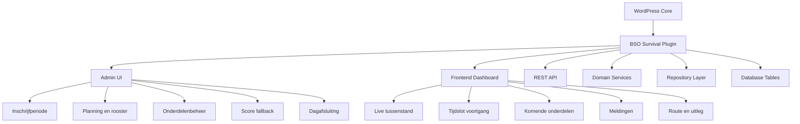

### Bouwblokken

| Laag | Verantwoordelijkheid |
|---|---|
| Presentation | Frontend dashboard, mobiele scoreformulieren, admin schermen |
| Application | Teaminschrijving, planning starten, score opslaan, dag sluiten |
| Domain | Roosteroptimalisatie, scoreberekening, jokerregels, statusovergangen |
| Infrastructure | WP hooks, custom tabellen, REST endpoints, auditlogging |

---

## 5. Datamodel

### ER-model

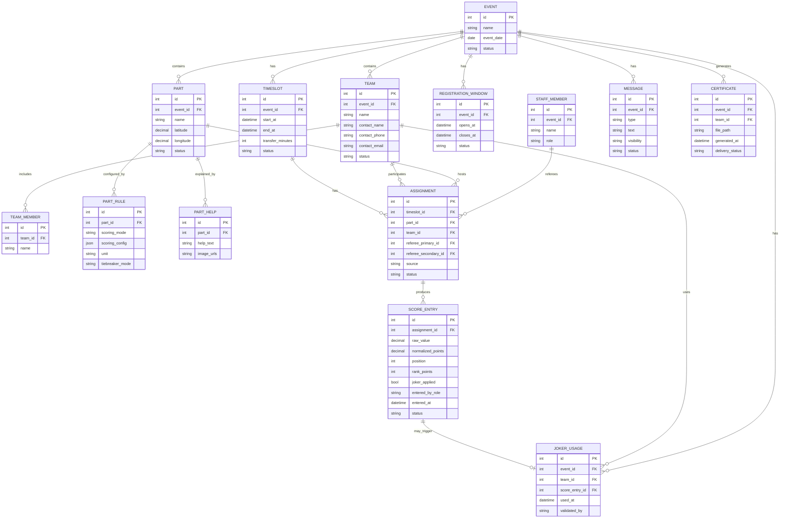

### Datamodeltoelichting

| Entiteit | Doel |
|---|---|
| Event | Een survivaldag met eigen levenscyclus |
| RegistrationWindow | Periode voor teaminschrijvingen |
| Timeslot | Speelvenster met begin/einde en wisseltijd |
| Team en TeamMember | Teamidentiteit en deelnemers |
| Part, PartRule en PartHelp | Onderdeel, scoremethode, uitleg en media |
| Assignment | Team-onderdeel-koppeling per tijdslot met scheidsrechters |
| ScoreEntry | Ruwe invoer, genormaliseerde score, positie en rankpunten |
| JokerUsage | Eenmalige jokerregistratie per team per event en onderdeel |
| Message | Dashboardmeldingen en operationele communicatie |
| Certificate | Downloadbaar deelnamebewijs en afleverstatus |

---

## 6. Dagplanning en roosteroptimalisatie

### Doel van de planning

Een routine berekent een zo optimaal mogelijk dagprogramma nadat inschrijving is gesloten.

Doelen:
- Teams zo gelijk mogelijk over onderdelen en tijdsloten verdelen.
- Teams zoveel mogelijk tegen verschillende tegenstanders laten spelen.
- Meestal 2 teams per onderdeel; incidenteel 1 team toestaan als dat planningstechnisch nodig is.

### Planningsconstraints

| Constraint | Waarde | Configureerbaar |
|---|---|---|
| Max teams | 22 (standaard) | Ja, in admin |
| Max onderdelen | 20 (standaard) | Ja, in admin |
| Standaard uitleg/instructietijd voor start ronde | 5 minuten | Ja, in admin |
| Standaard actieve duur per onderdeel | 20 minuten | Ja, in admin |
| Standaard rondeduur (uitleg + actief + wissel) | 30 minuten | Berekend |
| Standaard bezetting per onderdeel | 2 scheidsrechters | Vaste regel |
| Teams per onderdeel per tijdslot | bij voorkeur 2, minimaal 1 | Vaste regel |
| Wisseltijd tussen tijdsloten | 5 minuten | Ja, in admin |

Toepassing:
- De instructietijd wordt in het rooster meegenomen als voorbereidende fase per onderdeel voordat score-invoer start.
- Bij het configureren van parameters moeten start- en eindtijd van de survivaldag worden ingesteld; het systeem berekent daarna hoe veel rondes mogelijk zijn.

### Voorbeeld dagrooster met fase-indeling (genormaliseerd)

1. Ronde 1: 09:00 - 09:30 (uitleg 5, actief 20, wissel 5)
2. Ronde 2: 09:30 - 10:00 (uitleg 5, actief 20, wissel 5)
3. Ronde 3: 10:00 - 10:30 (uitleg 5, actief 20, wissel 5)
4. Ronde 4: 10:30 - 11:00 (uitleg 5, actief 20, wissel 5)
5. Ronde 5: 11:00 - 11:30 (uitleg 5, actief 20, wissel 5)
6. Operationele buffer: 11:30 - 11:55
7. Pauze: 11:55 - 13:00
8. Ronde 6: 13:00 - 13:30 (uitleg 5, actief 20, wissel 5)
9. Ronde 7: 13:30 - 14:00 (uitleg 5, actief 20, wissel 5)
10. Ronde 8: 14:00 - 14:30 (uitleg 5, actief 20, wissel 5)
11. Ronde 9: 14:30 - 15:00 (uitleg 5, actief 20, wissel 5)
12. Ronde 10: 15:00 - 15:30 (uitleg 5, actief 20, wissel 5)
13. Dagafsluiting en afronding: 15:30 - 15:55

### Optimalisatieflow

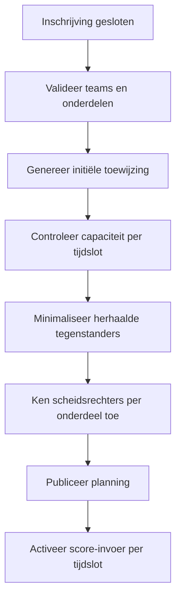

---

## 7. Belangrijkste workflows

### Workflow 1 - Team inschrijven

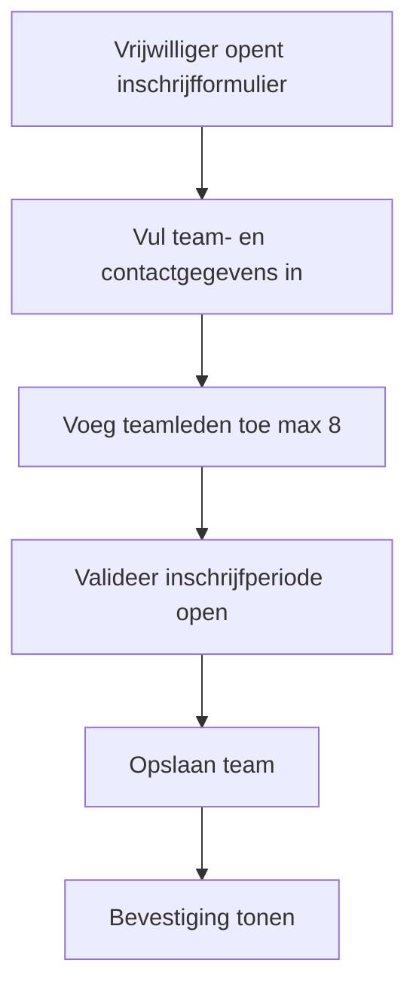

### Workflow 2 - Score invoeren door scheidsrechter

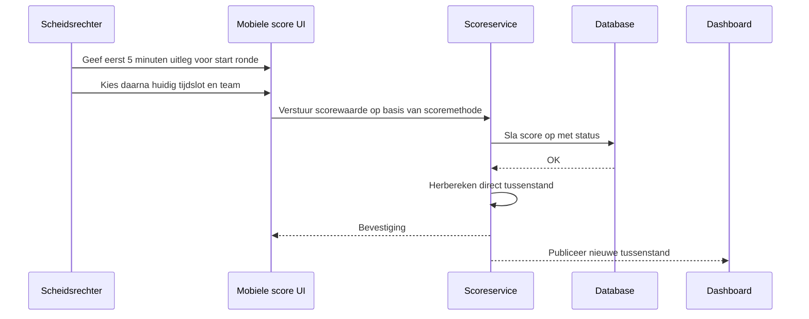

### Workflow 3 - Joker registreren

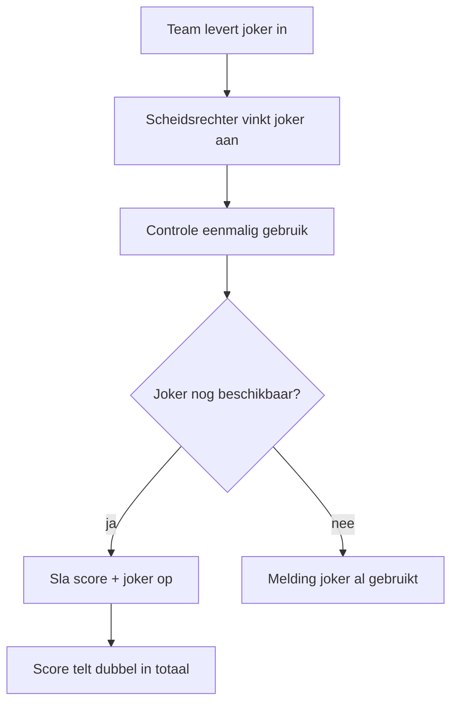

  ### Workflow 3b - Score, joker en tussenstand

  ```mermaid
  sequenceDiagram
    participant R as Scheidsrechter
    participant UI as Mobiele score UI
    participant API as Scoreservice
    participant DB as Database
    participant RNG as Rangschikking
    participant DASH as Dashboard

    R->>UI: Voer score in voor onderdeel
    UI->>API: Verstuur ruwe score + onderdeel + team
    API->>API: Controleer of joker nog beschikbaar is
    alt Joker ingezet
      API->>DB: Sla score op met joker = ja
      API->>RNG: Verdubbel rankpunten van dit onderdeel
    else Geen joker
      API->>DB: Sla score op met joker = nee
      API->>RNG: Bereken rankpunten op basis van positie
    end
    RNG->>API: Geef definitieve onderdeelplaatsing terug
    API->>DB: Werk tussenstand bij
    API-->>UI: Bevestiging
    API-->>DASH: Publiceer nieuwe tussenstand
    DASH-->>R: Actuele stand zichtbaar
  ```

### Workflow 4 - Fallback via leiding

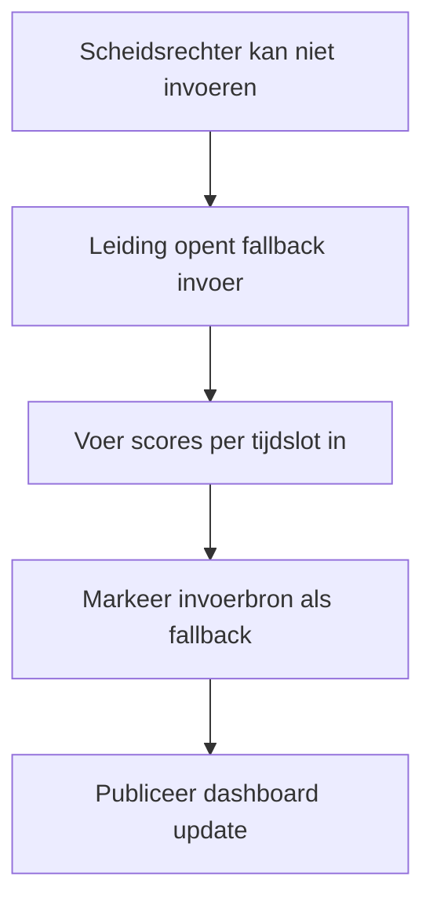

### Workflow 4b - Leiding controleert onderdeelrapportages

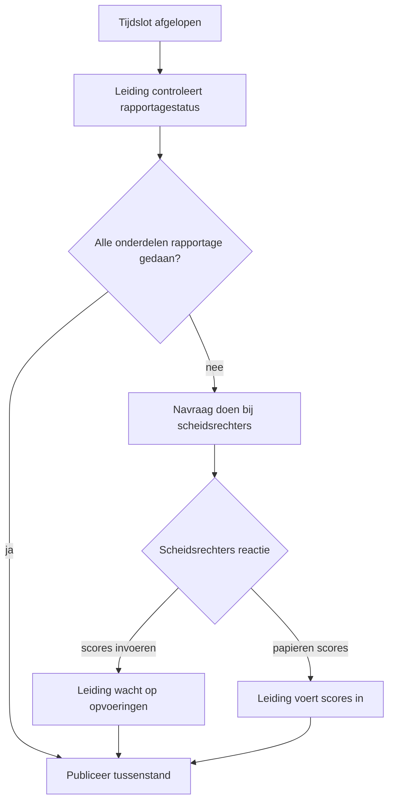

### Workflow 5 - Dag sluiten

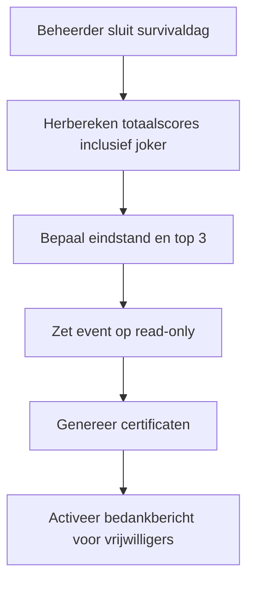

  ### Workflow 5b - Eindstand bepalen en publiceren

  ```mermaid
  sequenceDiagram
    participant R as Scheidsrechters
    participant L as Leiding
    participant S as Systeem
    participant DB as Database
    participant D as Dashboard

    R->>S: Lever definitieve onderdeelplaatsingen aan
    S->>DB: Sla definitieve plaatsingen op
    S->>S: Bereken rankpunten per onderdeel
    S->>S: Verdubbel rankpunten waar joker is ingezet
    S->>S: Agregeer alle afgeronde onderdelen tot totaalscore
    S->>S: Bepaal eindstand en podiumplaatsen
    S->>DB: Sla eindstand read-only op
    S-->>D: Publiceer eindstand op dashboard
    L-->>D: Controleer en accordeer publicatie
  ```

  ### Workflow 6 - Plaatsingsflow onderdeel naar eindstand

  ```mermaid
  flowchart TD
    A[Scheidsrechter rondt onderdeel af] --> B[Systeem doet voorstelplaatsing op basis van tijd/punten/afstand]
    B --> C[Scheidsrechter controleert en corrigeert indien nodig]
    C --> D[Definitieve onderdeelplaatsing opleveren aan leiding]
    D --> E[Leiding aggregeert plaatsingen van alle onderdelen]
    E --> F[Tussenstand en eindstand berekenen]
    F --> G[Resultaat zichtbaar op dashboard]
  ```

---

## 8. Dashboard en mobiele ervaring

### Dashboardcomponenten

| Component | Voor wie | Toelichting |
|---|---|---|
| Huidig tijdslot | Iedereen | Actief tijdslot en voortgang ten opzichte van totaal |
| Tussenstand | Iedereen | Actuele teampositie op basis van ingevoerde scores |
| Teamplanning | Vrijwilliger, teamlid, leiding | Reeds afgerond en komende onderdelen met tijden |
| Locatie en route | Vrijwilliger, teamlid | Route naar onderdeel met loopnavigatie |
| Onderdeeluitleg | Vrijwilliger, teamlid | Helptekst en afbeeldingen voor snelle instructie |
| Meldingenfeed | Iedereen | Actuele operationele meldingen en bijzonderheden |

### Mobiele eisen

| Eis | Uitwerking |
|---|---|
| Snelle leesbaarheid | Belangrijkste statusinformatie bovenaan |
| Lage invoerbelasting | Korte formulieren en contextafhankelijke velden |
| Grote bedienelementen | Geschikt voor gebruik buiten en tijdens beweging |
| Directe feedback | Na opslaan directe bevestiging en zichtbare statuswijziging |

### Dashboardflow

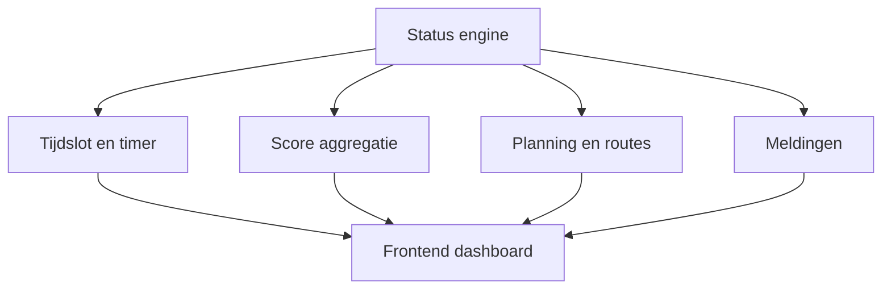

---

## 9. Beheer, score-invoer en onderdeelconfiguratie

### Onderdelenbeheer door beheerder

Per onderdeel kan beheer instellen:

- Naam en status.
- Scoremethode: tijd, punten of afstand.
- Helptekst en illustraties.
- GPS-coordinaten.
- Scheidsrechterkoppeling.

### Operationele parameters configureren

Beheerder kan volgende waarden per event instellen:

| Parameter | Standaard | Beschrijving |
|---|---|---|
| Max teams | 22 | Maximaal aantal deelnemende teams |
| Max onderdelen | 20 | Maximaal aantal onderdelen |
| Actieve duur onderdeel | 20 minuten | Speelduur per onderdeel |
| Uitleg/instructie duur | 5 minuten | Voorbereidingsduur door scheidsrechter |
| Wisseltijd | 5 minuten | Tijd tussen onderdelen |
| Rankpunten-formule | (max_teams + 1 - positie) × 10 | Formule voor omzetten positie naar punten |

### Score-invoer door scheidsrechter

| Stap | Beschrijving |
|---|---|
| 1 | Open huidig tijdslot en onderdeel |
| 2 | Controleer verwachte teams en aanwezigheid |
| 3 | Voer score in volgens ingestelde scoremethode |
| 4 | Registreer joker indien ingezet |
| 5 | Sla op en bevestig zichtbaar resultaat |

### Leiding-dashboard tijdens event

| Onderdeel | Doel |
|---|---|
| Tijdslotverloopdiagram | Zien welk tijdslot actief is van totaal |
| Onderdeel-rapportagestatus | Per afgerond tijdslot zien welke onderdelen hun scores hebben ingeleverd |
| Teampositieoverzicht | Actuele ranking op basis van ingevoerde scores |
| Contactzoeker | Vrijwilliger snel opzoeken voor overleg |
| Meldingenbeheer | Dashboardmeldingen aanpassen of oplossen |
| Fallback-scoreinvoer | Scores registreren bij operationele storingen |
| Scheidsrechter-navraag | Contact opnemen met scheidsrechters van ontbrekende onderdelen |

---

## 10. Meldingen, communicatie en certificaten

### Operationele dagstart en ondersteuning

| Moment | Betrokkenen | Actie |
|---|---|---|
| 08:00 | Scheidsrechters, leiding | Meldmoment op veld; uitgifte papieren onderdeeluitleg, portofoon en stopwatch |
| 08:15 | Teamleiders (vrijwilliger/ouder), leiding | Meldmoment; uitgifte joker, afgedrukte plattegrond met helpbeschrijvingen en teamschema |
| Einde dag | Scheidsrechters, leiding | Inname portofoons en stopwatches |

### Voorbereiding vooraf

- Minimaal 1 week voor de survivaldag ontvangen scheidsrechters werkinstructies per e-mail.
- Minimaal 1 week voor de survivaldag volgen scheidsrechters een live workshop over mobiel gebruik van de survival plugin.

### Leidingstent en veiligheidscontacten

- De leiding opereert gedurende de dag vanuit de leidingstent.
- In de leidingstent zijn leiding, beheerder en dj aanwezig ter ondersteuning van de daguitvoering.
- De leiding beschikt over directe contactgegevens van ambulancepersoneel voor medische hulp.
- De leiding beschikt over het telefoonnummer van de lokale wijkagent voor calamiteiten.
- De leiding beschikt over het mobiele nummer van de burgemeester of vervangend notabele voor de prijsuitreiking.
- De leiding beschikt over contactgegevens van de fotograaf; foto's kunnen na afloop bij de fotograaf worden nabesteld.

### Draaiboek op de dag zelf

#### 1. Voor opening (vanaf 07:30)

- [ ] Leidingstent operationeel: stroom, netwerk, dashboard en noodnummers gecontroleerd.
- [ ] Beheerder ingelogd in survival plugin en dagstatus op actief gezet.
- [ ] Materiaalbalie klaar: portofoons, stopwatches, papieren onderdeeluitleg, plattegronden, teamschema's, jokers.

#### 2. Meldmoment scheidsrechters (08:00)

- [ ] Aanwezigheid scheidsrechters geregistreerd.
- [ ] Per onderdeel 2 scheidsrechters bevestigd.
- [ ] Uitgifte afgerond: papieren onderdeeluitleg, portofoon, stopwatch.
- [ ] Korte veiligheidsbriefing gedaan (escalatielijn via leidingstent).

#### 3. Meldmoment teamleiders (08:15)

- [ ] Teamleiders aangemeld bij leiding.
- [ ] Uitgifte afgerond: 1 joker per team, plattegrond met helpbeschrijving, teamschema.
- [ ] Contactgegevens teamleider gecontroleerd voor noodgevallen.

#### 4. Start rondes en daguitvoering

- [ ] Leiding geeft centraal start- en eindsignaal per ronde.
- [ ] Per ronde wordt aangehouden: 5 min uitleg, 20 min actief, 5 min wissel.
- [ ] Na elke score-invoer wordt tussenstand automatisch herberekend en dashboard geverifieerd.
- [ ] Bij gelijke uitkomst bepalen uitsluitend de 2 gekoppelde scheidsrechters de onderdeelvolgorde.
- [ ] Incidenten/meldingen worden direct in dashboard geplaatst en opgevolgd.

#### 5. Pauze en herstart

- [ ] Pauzeproces uitgevoerd volgens planning (11:55 - 13:00).
- [ ] Voor herstart zijn alle onderdelen opnieuw operationeel bevestigd.

#### 6. Dagsluiting

- [ ] Alle onderdeelplaatsingen definitief aangeleverd aan leiding.
- [ ] Beheerder sluit survivaldag in plugin (read-only na sluiting).
- [ ] Eindstand en podium gecontroleerd en gepubliceerd.
- [ ] Certificaten gegenereerd en bedankbericht klaargezet/verzonden.

#### 7. Inname en afronding materiaal

- [ ] Alle portofoons en stopwatches ingenomen en afgevinkt.
- [ ] Openstaande meldingen en incidenten administratief afgerond.
- [ ] Contactmoment met fotograaf bevestigd (nabestellen foto's na afloop).

### Meldingsmodel

| Veld | Betekenis |
|---|---|
| type | info, waarschuwing, urgent, logistiek |
| text | Korte operationele melding |
| visibility | publiek, teamgericht, intern |
| status | actief, opgelost, gearchiveerd |

### Voorbeelden van meldingen

- Jas verloren.
- Handdoek gevonden/gezocht.
- Teamlid ontbreekt.
- Materiaal ontbreekt.
- Ouder aanwezig bij teamlocatie.

### Certificaat en bedankflow

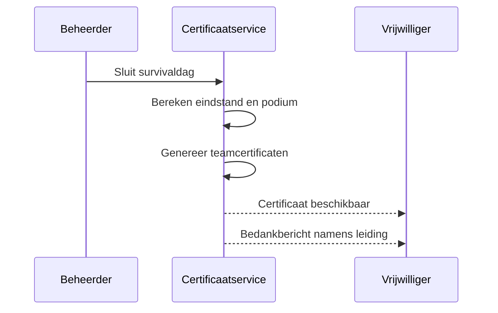

  ### Workflow 10b - Certificaat en prijsuitreiking

  ```mermaid
  sequenceDiagram
    participant S as Systeem
    participant B as Beheerder
    participant V as Vrijwilliger
    participant N as Notabele/Burgemeester
    participant F as Fotograaf

    S->>S: Finaliseer eindstand en podiumplaatsen
    S->>S: Genereer certificaat per team
    S->>B: Maak certificaten en bedankbericht beschikbaar
    B->>N: Bereid prijsuitreiking voor
    B->>F: Bevestig foto-afhandeling en nabestelling
    B-->>V: Certificaat beschikbaar
    B-->>V: Bedankbericht namens leiding
  ```

---

## 11. Berekeningen en statuslogica

### Scoreconversie per scoremethode

Per onderdeel is een scoremethode geconfigureerd (`time`, `points`, `distance` of later custom).
De plugin gebruikt een registreerbare architectuur via `ScoringMethodRegistry` en `ScoringMethodInterface`.

Verwerkingsstappen per score-entry:
1. Valideer ruwe invoer met `validateRawValue`.
2. Normaliseer naar schaal 0-100 met `normalizeToPoints`.
3. Genereer plaatsingsvoorstel met `generatePositionProposal`.
4. Laat scheidsrechtervolgorde bevestigen/corrigeren.
5. Zet definitieve positie om naar rankpunten.

Voor ieder onderdeel wordt een ruwe score ingevoerd en vertaald naar genormaliseerde punten.

$$
score_{basis} = normaliseer(raw\, waarde, methode)
$$

$$
score_{totaal\_entry} = score_{basis} + bonus - straf
$$

$$
score_{totaal\_entry\_met\_joker} =
\begin{cases}
2 \times score_{totaal\_entry}, & \text{als joker ingezet} \\
score_{totaal\_entry}, & \text{anders}
\end{cases}
$$

$$
score_{team\_eind} = \sum score_{totaal\_entry\_met\_joker}
$$

Custom scoremethodes kunnen extensiegewijs worden toegevoegd via:

```php
add_action('bso_survival_register_scoring_methods', function () {
  // ScoringMethodRegistry::register('custom_id', new CustomScoringMethod());
});
```

### Jokerregels

- Een team mag precies 1 joker gebruiken per event.
- De joker mag op precies 1 onderdeel worden ingezet.
- De joker moet worden vastgelegd voordat de score definitief wordt opgeslagen.
- Bij dubbele inzetpoging wordt de tweede inzet geweigerd.

### Ranking op basis van positie

De tussentijdse plaatsing van teams wordt bepaald op basis van de posities die teams halen op afgeronde onderdelen. Per onderdeel krijgt ieder team precies één positie; gelijke posities zijn niet toegestaan.

Als twee teams gelijk eindigen op een onderdeel, bepalen de twee scheidsrechters van dat onderdeel gezamenlijk welk team de betere positie krijgt. Daardoor ontstaan er geen dubbele posities.

De positie wordt vervolgens omgezet naar een ranking-score via een vaste formule. Voor een survivaldag met 22 teams kan dat bijvoorbeeld zijn:

$$
rankpunten = (max\_teams + 1 - positie) \times 10
$$

Bij $max\_teams = 22$ levert dit de reeks 220, 210, 200, ..., 10 op.

Als een team op een onderdeel een joker inzet, dan wordt de rankpunten-score van dat onderdeel verdubbeld voordat die score meedoet aan de tussenstand en eindstand:

$$
rankpunten_{met\_joker} =
\begin{cases}
2 \times rankpunten, & \text{als joker ingezet} \\
rankpunten, & \text{anders}
\end{cases}
$$

| Positie | Rankpunten |
|---|---:|
| 1 | 220 |
| 2 | 210 |
| 3 | 200 |
| 4 | 190 |
| 5 | 180 |
| 6 | 170 |
| 7 | 160 |
| 8 | 150 |
| 9 | 140 |
| 10 | 130 |
| 11 | 120 |
| 12 | 110 |
| 13 | 100 |
| 14 | 90 |
| 15 | 80 |
| 16 | 70 |
| 17 | 60 |
| 18 | 50 |
| 19 | 40 |
| 20 | 30 |
| 21 | 20 |
| 22 | 10 |

Voordeel van deze aanpak:
- De berekening blijft simpel en reproduceerbaar.
- De positie blijft leidend; de punten zijn alleen een rekenhulp.
- Als het aantal teams ooit wijzigt, kan de formule worden aangepast zonder de logica te herschrijven.
- Een joker werkt dus als vermenigvuldiger op de rankpunten van precies dat onderdeel.

### Plaatsingslogica per onderdeel en totaal

Per onderdeel bepaalt het systeem eerst een voorgestelde plaatsing op basis van de gekozen scoremethode. Daarna kan de scheidsrechter de volgorde corrigeren voordat deze definitief wordt gemaakt.

Bij gelijke uitkomst (gelijke tijd, punten of afstand) geldt een expliciete beslisregel:
- De twee gekoppelde scheidsrechters van dat onderdeel bepalen gezamenlijk de definitieve volgorde.
- Teams en leiding hebben hierbij geen enkele invloed.

$$
plaatsing_{voorstel, onderdeel} = sorteer(score_{totaal\_entry\_met\_joker}, methode)
$$

$$
plaatsing_{definitief, onderdeel} = bevestig(plaatsing_{voorstel, onderdeel}, correcties_{scheidsrechter})
$$

Voor de tussentijdse stand wordt per afgerond onderdeel de rankpunten-score gebruikt:

$$
rankpunten_{team, onderdeel} = f(positie_{team, onderdeel})
$$

$$
tussenstand_{team} = \sum rankpunten_{team, afgeronde\_onderdelen}
$$

De leiding berekent daarna de tussenstand en eindstand op basis van de definitieve onderdeelplaatsingen van alle onderdelen.

$$
positie_{team, totaal} = aggregeer(plaatsing_{definitief, onderdeel\_1..n})
$$

Realtime regel:
- Na elke nieuwe of aangepaste score-entry herberekent het systeem direct de tussenstand en publiceert die naar het dashboard.
- De live tussenstand wordt berekend op basis van de som van rankpunten van afgeronde onderdelen; teams met minder afgeronde onderdelen worden niet genormaliseerd, maar uitsluitend vergeleken op basis van hun actuele afgeronde onderdelen en zichtbaar als tussentijdse stand.
- Voor de tussentijdse stand hoeven niet alle onderdelen rapportages te hebben; de leiding verkrijgt doorgaans resultaten gedurende en na elk tijdslot naarmate scheidsrechters invoeren.

### Statuswaarden

| Entiteit | Status |
|---|---|
| Event | concept, gepland, actief, gesloten |
| RegistrationWindow | open, gesloten |
| Timeslot | gepland, actief, afgerond |
| Team | ingeschreven, actief, gediskwalificeerd |
| ScoreEntry | concept, gevalideerd, gepubliceerd |
| Message | actief, opgelost, gearchiveerd |

---

## 12. Beveiliging en toegang

### Autorisatie

| Functie | Toegangsmodel |
|---|---|
| Teaminschrijving | Publieke flow binnen open inschrijfperiode |
| Score-invoer | Capability voor scheidsrechter, leiding en beheerder |
| Definitieve onderdeelplaatsing bij gelijke uitkomst | Alleen de twee gekoppelde scheidsrechters van het onderdeel |
| Plannen/sluiten survival | Alleen beheerder |
| Meldingen bewerken | Leiding en beheerder |

### Veiligheidsmaatregelen

- Nonce-validatie op alle muterende acties.
- Server-side validatie op team-, tijdslot- en onderdeelkoppeling.
- Controle op joker-eenmaligheid in transactielogica.
- Audittrail voor scorewijziging, scheidsrechterwissel, dagsluiting en meldingsbeheer.
- Read-only afdwinging na dagsluiting.

---

## 13. MVP, doorontwikkeling en acceptatiecriteria

### MVP voor v2

De MVP bevat minimaal:

- Teaminschrijving met open/sluitbare inschrijfperiode.
- Dagplanning met tijdsloten, teamtoewijzing en onderdeelkoppeling.
- Onderdeelconfiguratie met scoremethode, helptekst en GPS-locatie.
- Mobiele score-invoer met jokerregistratie en fallback door leiding.
- Live dashboard met voortgang, tussenstand, planning, meldingen en route.
- Dagsluiting met definitieve eindstand, top 3, certificaatgeneratie en bedankbericht.

### Roadmap na MVP

| Fase | Uitbreiding |
|---|---|
| v2.1 | Geavanceerde planningsoptimalisatie met handmatige herverdeling |
| v2.2 | Live push-updates en performancecaching voor dashboard |
| v2.3 | Uitgebreide rapportage en export voor organisatie |
| v2.4 | Multi-event seizoensoverzicht en vergelijkende statistieken |

### Functionele acceptatiecriteria

1. Beheer kan een survival pas plannen nadat inschrijving gesloten is.
2. Planning levert per tijdslot een bruikbare team-onderdeelindeling op.
3. Scheidsrechters kunnen scores invoeren volgens onderdeel-specifieke scoremethode.
4. Na elke score-invoer wordt de tussenstand direct herberekend en geactualiseerd op het dashboard.
5. Joker kan precies eenmaal per team worden ingezet en telt dubbel in de totaalscore.
6. Vrijwilligers en teamleden zien afgeronde en komende onderdelen inclusief tijden.
7. Route naar onderdeel is beschikbaar via walking navigatie.
8. Leiding kan bij storingen scores via fallback invoeren zonder dataverlies.
9. Beheer kan survivaldag sluiten waarna data read-only wordt.
10. Eindstand houdt rekening met joker en bepaalt podiumplaatsen 1, 2 en 3.
11. Per team is certificaatdownload beschikbaar met teaminformatie en resultaten.
12. Vrijwilligers ontvangen na afloop een bedankbericht namens leiding.
13. Per onderdeel wordt eerst een systeemvoorstel voor teamplaatsing gedaan, waarna de scheidsrechter de volgorde kan corrigeren en definitief opleveren aan leiding.
14. Bij gelijke uitkomst op een onderdeel bepalen uitsluitend de twee gekoppelde scheidsrechters gezamenlijk de definitieve teamvolgorde; teams en leiding hebben daarop geen invloed.
15. De dagstartprocedure is geborgd: scheidsrechters melden om 08:00, teamleiders om 08:15, middelen worden uitgegeven en aan het einde van de dag weer ingenomen, en de leiding heeft alle benodigde veiligheids- en operationele contactlijnen beschikbaar.
16. Operationele parameters (max teams, max onderdelen, rondetijden) zijn configureerbaar in admin.
17. Scheidsrechters zijn gezamenlijk verantwoordelijk voor de definitieve teamplaatsing op hun onderdeel; leiding controleert of alle onderdelen na elk tijdslot rapportages hebben ingeleverd.
18. Voor tussentijdse resultaten hoeven niet alle teams evenveel scores te hebben; leiding voert navraag uit bij ontbrekende onderdeelrapportages.

---

*Gegenereerd op 7 juli 2026 · BSO Survival v2 concept*