# Functioneel Ontwerp - BSO Survival

## Inhoudsopgave

1. [Inleiding en doel](#1-inleiding-en-doel)
2. [Architectuuroverzicht](#2-architectuuroverzicht)
3. [Datamodel](#3-datamodel)
4. [Beheer - Adminomgeving](#4-beheer---adminomgeving)
5. [Frontend - Shortcode Kaart](#5-frontend---shortcode-kaart)
6. [REST API](#6-rest-api)
7. [Bedrijfslogica](#7-bedrijfslogica)
8. [Klassenstructuur](#8-klassenstructuur)
9. [Activatie en Deinstallatie](#9-activatie-en-deinstallatie)
10. [Assets en Scripts](#10-assets-en-scripts)
11. [Gebruikersrollen en toegang](#11-gebruikersrollen-en-toegang)

---

## 1. Inleiding en doel

BSO Survival digitaliseert het scoreproces van het jaarlijkse survival-evenement in Zwolle (Westenholte). De plugin vervangt handmatige Excel-afhandeling door centrale online registratie en publicatie van tussenstanden.

### Doelgroepen

| Doelgroep | Context | Primaire behoefte |
|---|---|---|
| Organisatoren | WordPress beheer | Instellingen beheren, scoreberekening starten, overzichten tonen |
| Scheidsrechters | Ingelogde rol referee/administrator | Scores en posities invoeren per survival en team |
| Teamleiders/teams/publiek | Frontend | Tussenstanden, survivalinformatie en teamresultaten bekijken |

### Kernfunctionaliteit

| Onderdeel | Omschrijving |
|---|---|
| Datalaag | Tabellen voor team, survival, referee, timeslot en score |
| Scoring | Positiegebaseerde puntenberekening met joker-verdubbeling |
| Admin | Instellingenpagina en toolspagina voor berekening/controle |
| Frontend | Shortcodes voor scorelijsten, updateformulier en survival-help |
| Lokalisatie | Nederlands en Engels voor teksten en help-partials |

---

## 2. Architectuuroverzicht

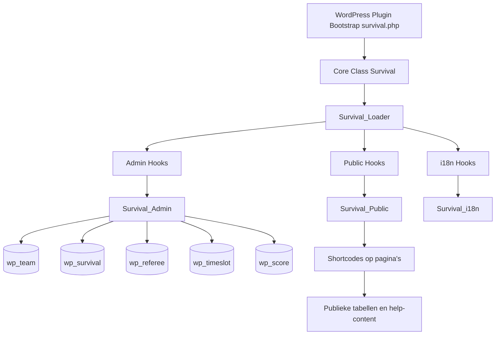

Architectuurkenmerken:

- De plugin gebruikt een loader-patroon om WordPress hooks centraal te registreren.
- De adminlaag bevat zowel beheerpagina's als meerdere business-shortcodes.
- De publieke laag levert vooral meertalige helpweergave en pagina-partials.

---

## 3. Datamodel

### ER-model

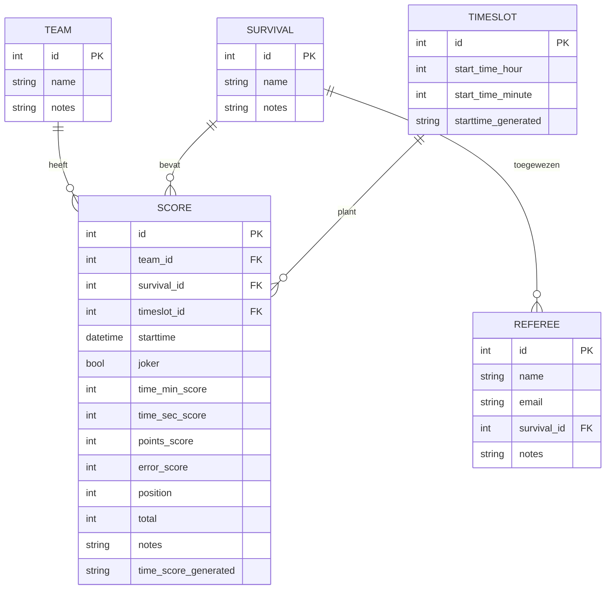

### Tabeltoelichtingen per veld

| Tabel | Belangrijkste velden | Functionele betekenis |
|---|---|---|
| team | id, name, notes | Teamidentiteit en notities |
| survival | id, name, notes | Survivalonderdelen/wedstrijden |
| referee | id, name, email, survival_id | Scheidsrechter gekoppeld aan survival |
| timeslot | id, start_time_hour, start_time_minute, starttime | Speelvensters op de dag |
| score | team_id, survival_id, timeslot_id, joker, position, total | Registratie en berekening van scores |

### Initiele dataset (activatie)

| Entity | Initieel |
|---|---|
| Teams | 20 |
| Survivals | 12 |
| Referees | 20 |
| Timeslots | 12 |
| Score-rijen | 2880 (vooraf gegenereerd rooster) |

---

## 4. Beheer - Adminomgeving

### Menuboom

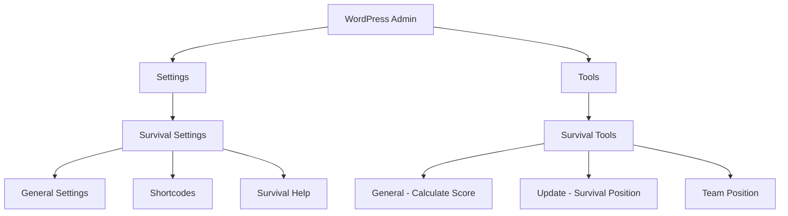

### Submenu: Survival Settings - General (Update instelling)

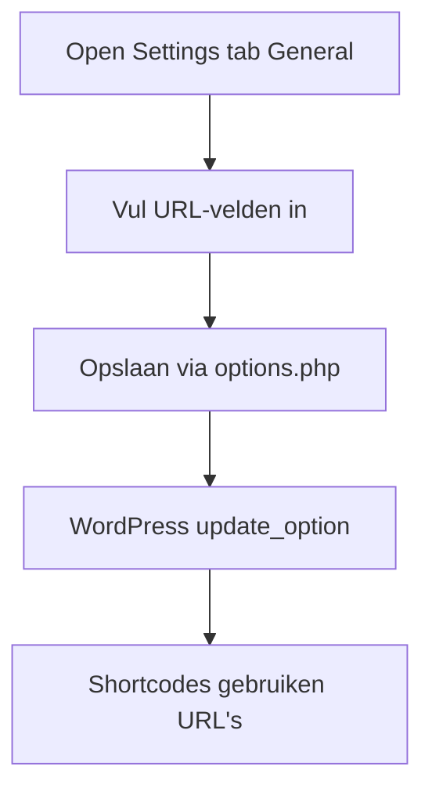

Formuliervelden:

| Veld | Optie | Gebruik |
|---|---|---|
| Team score page URL | survival_team_score_page | Link voor teamscore-overzichten |
| Survival page URL | survival_survival_page | Link voor survival-overzichten |
| Score update page URL | survival_score_page | Link naar updateformulier |

### Submenu: Survival Tools - General (Create/Herbereken score)

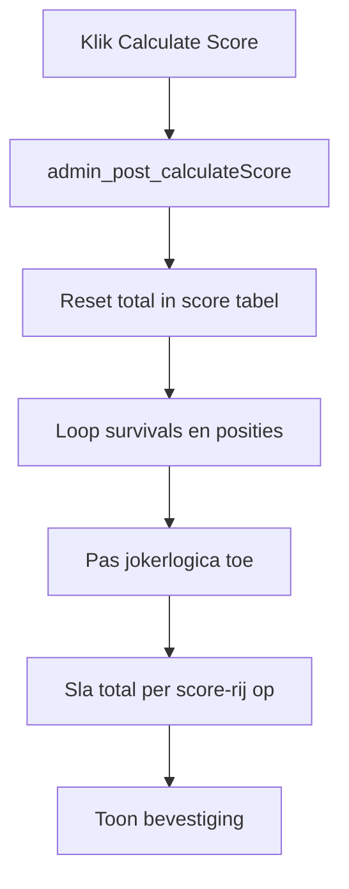

### Submenu: Survival Tools - Update (Read)

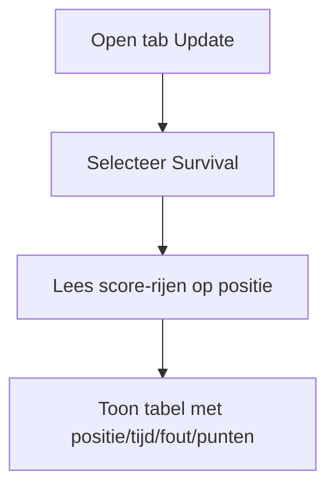

### Submenu: Survival Tools - Team Position (Read)

```mermaid
flowchart TD
		A[Open tab Team Position] --> B[Aggregatie sum(total) per team]
		B --> C[Sorteer aflopend]
		C --> D[Toon rankinglijst]
```

---

## 5. Frontend - Shortcode Kaart

### Shortcode definitie

| Shortcode | Type | Functie |
|---|---|---|
| [survival_list] | Data | Lijst van survivals |
| [team_list] | Data | Lijst teams met link naar teamscores |
| [referee_list] | Data | Lijst scheidsrechters |
| [referee_survival_list] | Data | Scheidsrechter met survival-link |
| [team_score_survival_list] | Data | Team -> alle survival-scores |
| [survival_team_score] | Data | Survival -> teams per timeslot |
| [team_score_update] | Form | Score invoeren/bijwerken |
| [display_score] | Data | Eindranking |
| [survival_update_position] | Data | Positieoverzicht per survival |
| [survival_help], [survival_page], [survival_01_page] ... [survival_11_page] | Help | Meertalige hulpinhoud |

### Renderflow

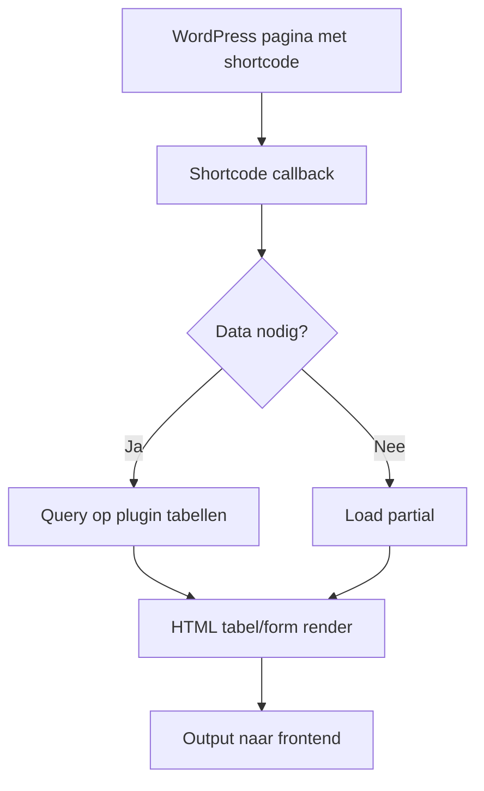

### Componentdiagram frontend

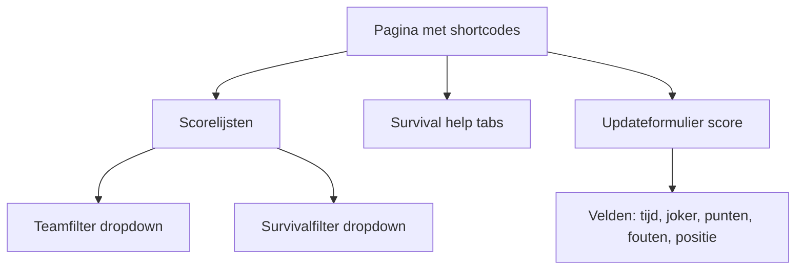

### Popup-opbouw

Geen modal popup-component aangetroffen in huidige implementatie. Interactie verloopt via standaard tabellen, links en formulieren.

---

## 6. REST API

Er zijn in de huidige versie geen custom REST-endpoints geregistreerd. De plugin gebruikt:

- WordPress hooks
- admin-post acties
- shortcode rendering

### Endpointoverzicht

| Endpoint | Methode | Status |
|---|---|---|
| custom REST endpoint | n.v.t. | Niet geimplementeerd |

### Parameters

| Parameter | Bron | Toelichting |
|---|---|---|
| TeamId | querystring | Filter op team in scoreoverzichten |
| SurvivalId | querystring | Filter op survival in scoreoverzichten |
| ScoreId | querystring | Doelrecord voor score-updateformulier |

### JSON-responsvoorbeeld

```json
{
	"status": "n.v.t.",
	"message": "Geen custom REST API in deze pluginversie"
}
```

### Interactiesequentie (zonder REST)

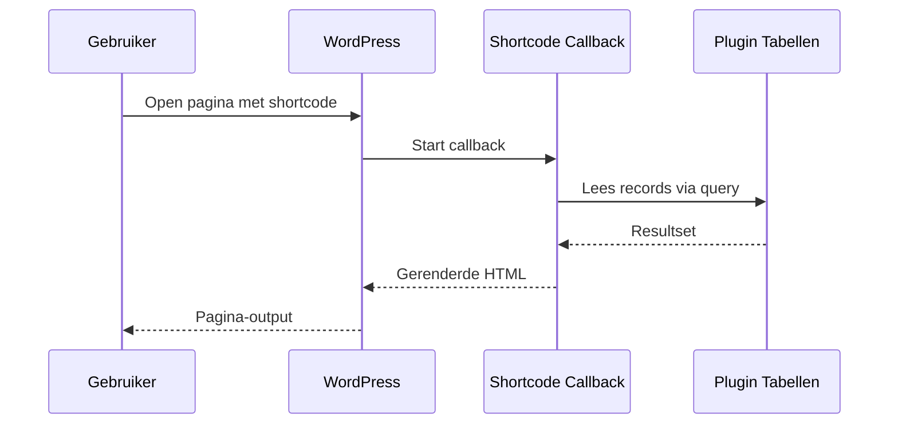

---

## 7. Bedrijfslogica

### 7.1 Berekeningen

Positionele score per survival:

$$
P_{basis}(positie) = N_{teams} - positie
$$

Jokercorrectie:

$$
P_{effectief} =
\begin{cases}
2 \cdot P_{basis} & \text{als joker = 1} \\
P_{basis} & \text{als joker = 0}
\end{cases}
$$

Teamtotaal:

$$
T_{team} = \sum_{i=1}^{k} P_{effectief,i}
$$

Voorbeeld (20 teams):

| Positie | Basispunten | Joker | Effectieve punten |
|---|---:|---:|---:|
| 1 | 19 | 0 | 19 |
| 2 | 18 | 1 | 36 |
| 5 | 15 | 0 | 15 |
| 10 | 10 | 0 | 10 |

### 7.2 Validatie

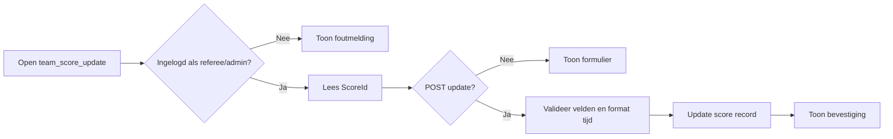

Methodetabel validatie/controle:

| Methode | Doel |
|---|---|
| validUserRole() | Rolcontrole referee/administrator |
| check_user_role($role) | Controle op WordPress gebruikersrol |
| teamScoreUpdate() | Validatie en opslag scoreformulier |
| register_setting() | Definieert en registreert URL-instellingen |

---

## 8. Klassenstructuur

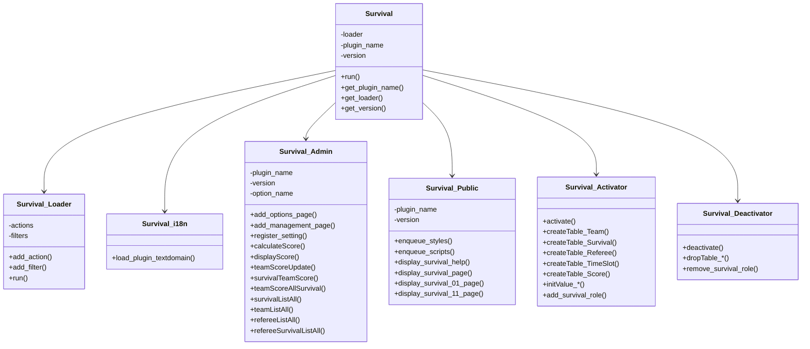

---

## 9. Activatie en Deinstallatie

### Activatieflow

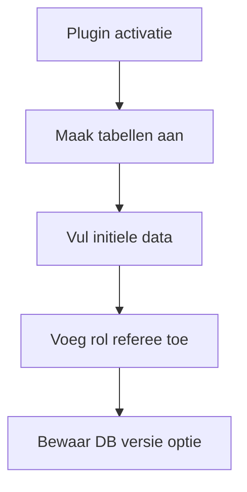

### Bootstrap-volgorde

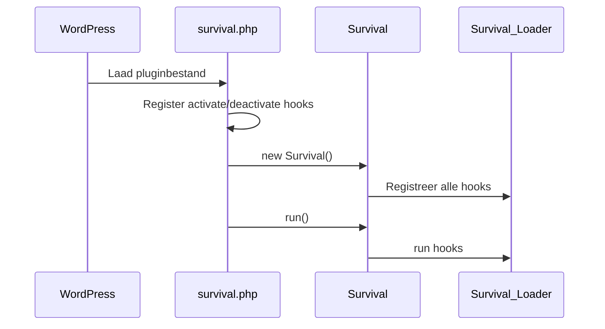

### Deinstallatiestappen

| Trigger | Gedrag |
|---|---|
| Deactivatie | Dropt tabellen score/referee/team/survival/timeslot en verwijdert rol referee |
| Uninstall | Alleen WP_UNINSTALL_PLUGIN check; geen extra cleanup geïmplementeerd |

---

## 10. Assets en Scripts

### Overzicht assets

| Asset | Locatie | Gebruik |
|---|---|---|
| Admin CSS | admin/css/survival-admin.css | Layout van settings/tools en tabellen |
| Admin JS | admin/js/survival-admin.js | Admin interactie (basis) |
| Public CSS | public/css/survival-public.css | Frontend styling voor score/help pagina's |
| Public JS | public/js/survival-public.js | Frontend interactie (basis) |
| Help partials | public/partials/*.php | Inhoud survival-help per taal/pagina |

### Flow: score-update knop

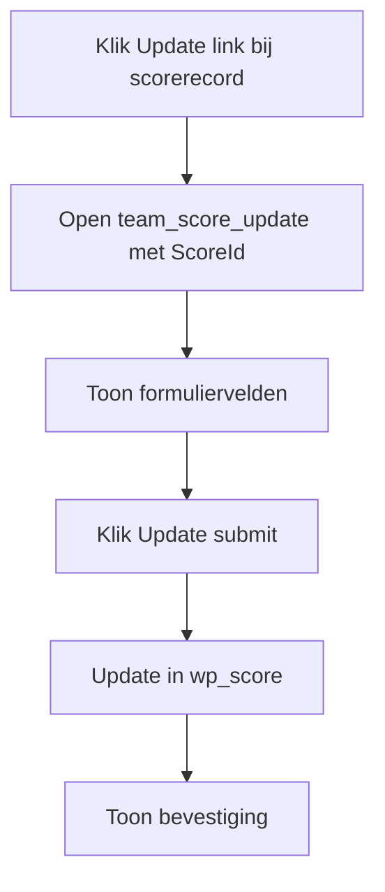

### Flow: frontend scorelogica

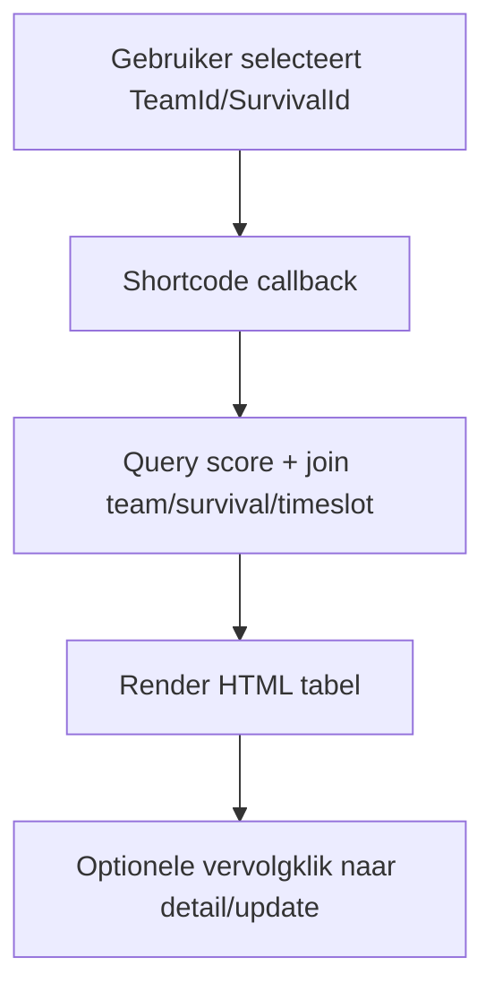

---

## 11. Gebruikersrollen en toegang

### Toegangsdiagram

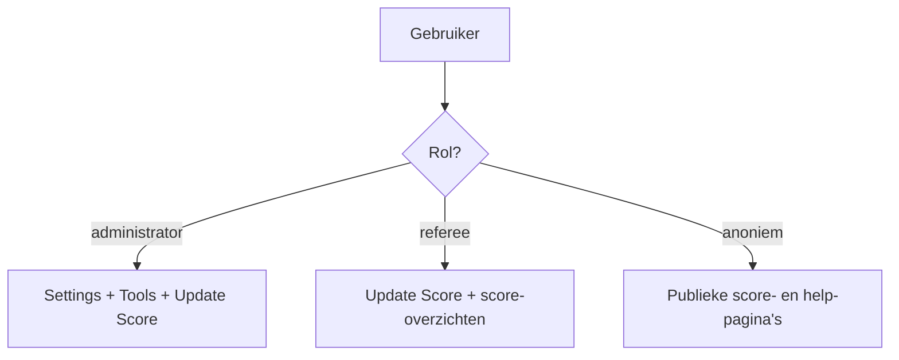

### Samenvatting rechten

| Rol | Toegang |
|---|---|
| administrator | Volledige toegang tot instellingen, tools en scoreberekening |
| referee | Scoremutatie via shortcodeformulier en lezen van overzichten |
| anonieme bezoeker | Alleen leesbare score- en helpweergaven |

### Functionele aandachtspunten

| Punt | Impact |
|---|---|
| Joker-weergave in teamScoreAllSurvival gebruikt niet het huidige recordobject | Onjuiste ja/nee-weergave mogelijk |
| survival_12_page wordt functioneel verwacht maar niet als shortcode geregistreerd | Onvolledige helpnavigatie |
| Schema en planning zijn hardcoded op 20 teams / 12 survivals / 12 slots | Beperkte schaalbaarheid zonder codewijziging |

---

*Gegenereerd op 5 juli 2026 · BSO Survival v1.0.0*
