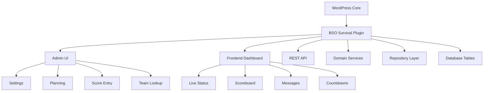
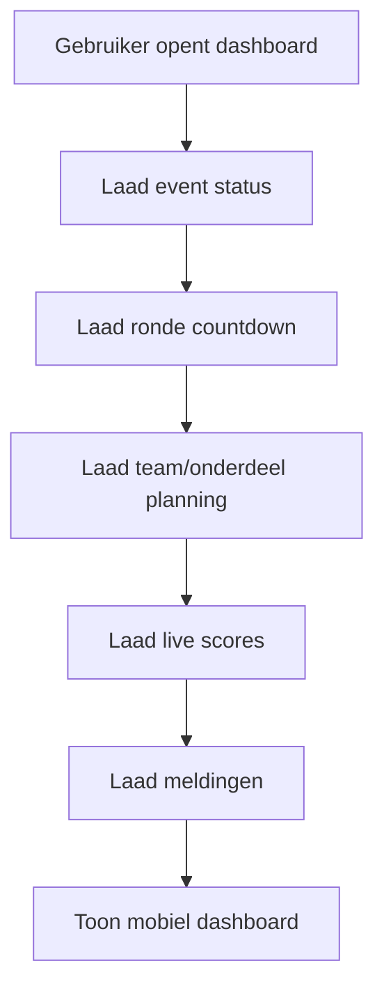
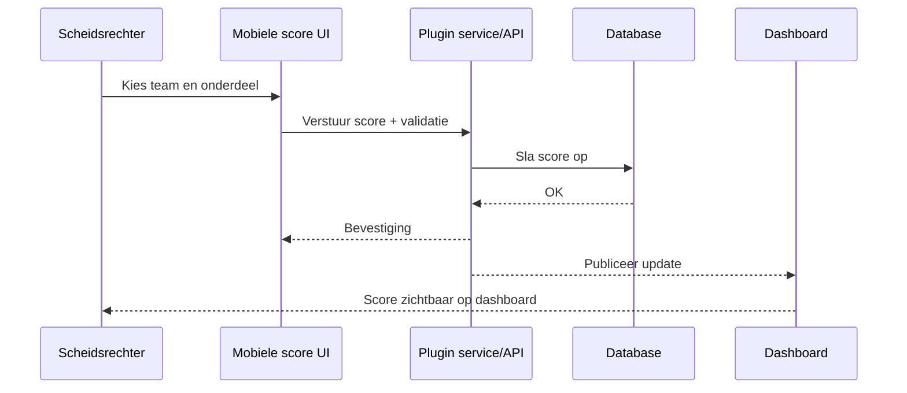
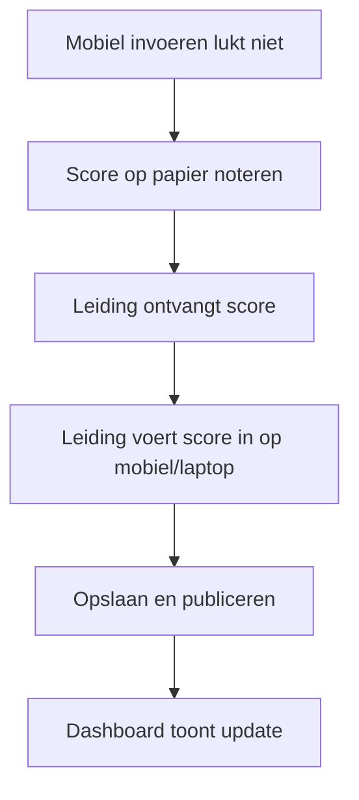
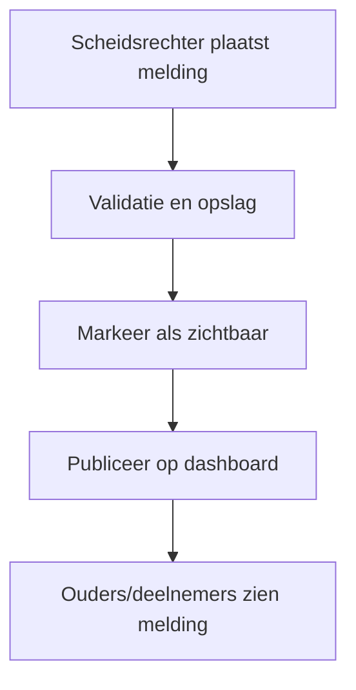
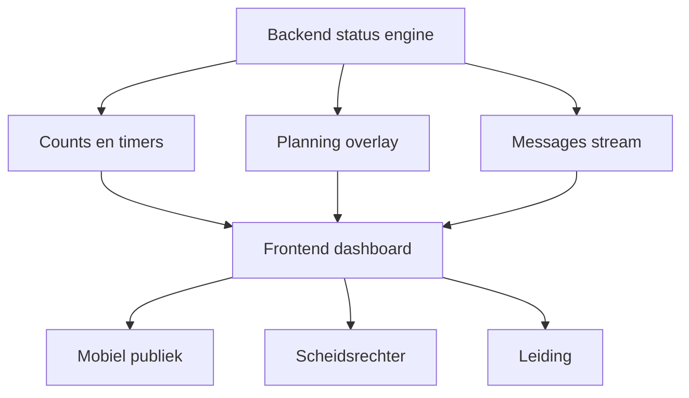
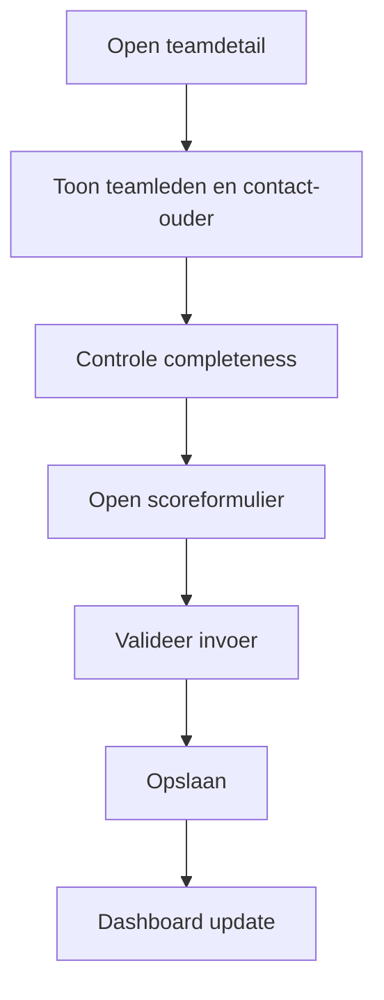
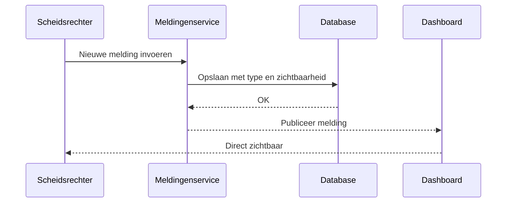
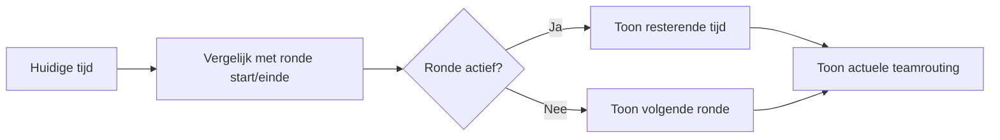

# Functioneel Ontwerp v2 - BSO Survival

## Inhoudsopgave

1. [Visie en uitgangspunten](#1-visie-en-uitgangspunten)
2. [Doelgroepen en rollen](#2-doelgroepen-en-rollen)
3. [User Story gebaseerde scope](#3-user-story-gebaseerde-scope)
4. [Architectuur voor WordPress best practice](#4-architectuur-voor-wordpress-best-practice)
5. [Datamodel](#5-datamodel)
6. [Belangrijkste workflows](#6-belangrijkste-workflows)
7. [Dashboard en mobiele ervaring](#7-dashboard-en-mobiele-ervaring)
8. [Beheer en score invoer](#8-beheer-en-score-invoer)
9. [Kennisgeving en meldingen](#9-kennisgeving-en-meldingen)
10. [Berekeningen en statuslogica](#10-berekeningen-en-statuslogica)
11. [Beveiliging en toegang](#11-beveiliging-en-toegang)
12. [MVP, doorontwikkeling en hergebruik](#12-mvp-doorontwikkeling-en-hergebruik)
13. [Functionele acceptatiecriteria](#13-functionele-acceptatiecriteria)

---

## 1. Visie en uitgangspunten

BSO Survival v2 is een vanaf de basis opnieuw ontworpen WordPress plugin voor het survival-evenement in Westenholte. Het doel is niet alleen scores registreren, maar een live event-platform bouwen dat deelnemers, ouders, scheidsrechters en leiding in real time ondersteunt op mobiel en desktop.

### Kernvisie

- Deelnemers en ouders kunnen tussentijdse scores en eindscores direct op mobiel bekijken.
- Scheidsrechters kunnen scores foutarm op mobiel invoeren of, als dat nodig is, op papier aan de leiding doorgeven.
- De front-end toont een live dashboard met voortgang, planning, teaminformatie en incidentmeldingen.
- De plugin wordt modulair opgebouwd volgens WordPress best practices en vanuit user stories ontwikkeld.

### Ontwerpprincipes

| Principe | Betekenis |
|---|---|
| Mobile first | Alle kernacties moeten goed bruikbaar zijn op telefoon en tablet |
| User story driven | Functioneel ontwerp, backlog en implementatie volgen concrete stories |
| Uitbreidbaar | Modules voor dashboard, scoring, teams en meldingen zijn los koppelbaar |
| Betrouwbaar | Validatie, statusbewaking en fallback-processen zijn ingebouwd |
| WordPress native | Rollen, capabilities, REST API, settings API en admin menu's worden volgens WP-conventies gebruikt |

---

## 2. Doelgroepen en rollen

| Rol | Context | Primaire taak | Device |
|---|---|---|---|
| Deelnemer | Front-end bezoeker | Uitslagen volgen | Mobiel |
| Ouder | Front-end bezoeker | Team voortgang volgen | Mobiel |
| Scheidsrechter | Ingelogde gebruiker | Score invoeren, team controleren, meldingen plaatsen | Mobiel |
| Leiding | Ingelogde gebruiker | Score snel invoeren bij fallback, overzicht bewaken | Mobiel/laptop |
| Organisatiebeheerder | WordPress admin | Configuratie, planning, gebruikers, dashboardbeheer | Laptop |

### Functionele rechten

| Functie | Scheidsrechter | Leiding | Beheerder | Publiek |
|---|---:|---:|---:|---:|
| Tussenstand bekijken | ja | ja | ja | ja |
| Eindscore bekijken | ja | ja | ja | ja |
| Score invoeren | ja | ja | ja | nee |
| Teamcompleetheid controleren | ja | ja | ja | nee |
| Meldingen plaatsen | ja | ja | ja | nee |
| Configuratie beheren | nee | nee | ja | nee |

---

## 3. User Story gebaseerde scope

De v2 wordt opgezet vanuit epics en concrete user stories. De voorbeelden uit de vraag zijn hieronder omgezet naar complete stories.

### Epic A - Live scorebeleving voor deelnemers en ouders

**US-A1 - Tussenstand mobiel bekijken**

Als deelnemer of ouder wil ik op mijn mobiel de actuele tussenstand zien, zodat ik direct begrijp hoe ons team ervoor staat.

Acceptatiecriteria:
- De tussenstand is mobiel leesbaar zonder inzoomen.
- De ranking wordt automatisch ververst of eenvoudig herlaadbaar aangeboden.
- De weergave toont teamnaam, score en positie.

**US-A2 - Eindscore mobiel bekijken**

Als deelnemer of ouder wil ik na afloop de eindscore zien, zodat ik het resultaat van de survival direct kan volgen.

Acceptatiecriteria:
- Eindscore is zichtbaar zodra de organisatie deze vrijgeeft.
- De eindscore gebruikt dezelfde teamidentiteit als de tussenstand.
- De pagina toont duidelijk of de score definitief is.

### Epic B - Foutvrije score-invoer voor scheidsrechters en leiding

**US-B1 - Score invoeren op mobiel**

Als scheidsrechter wil ik op mijn mobiel snel de behaalde score per onderdeel en per team kunnen invoeren, zodat ik tijdens de ronde geen papierwerk hoef te gebruiken.

Acceptatiecriteria:
- De invoerpagina toont alleen de teams en onderdelen die voor de scheidsrechter relevant zijn.
- De gebruiker krijgt grote knoppen, korte velden en directe validatie.
- Het opslaan van een score geeft onmiddellijke bevestiging.

**US-B2 - Score invoeren via papierfallback**

Als scheidsrechter wil ik scores op papier kunnen doorgeven aan de leiding wanneer mobiel invoeren niet lukt, zodat de score toch snel en foutarm in het systeem komt.

Acceptatiecriteria:
- De leiding kan dezelfde score handmatig invoeren op mobiel of laptop.
- De invoerflow ondersteunt fallback zonder verlies van data.
- Elke fallback-invoer krijgt een duidelijke status en bronmelding.

**US-B3 - Score invoeren op laptop door leiding**

Als leiding wil ik scores snel op laptop kunnen invoeren, zodat ik piekmomenten of fallback-situaties efficiënt kan afhandelen.

Acceptatiecriteria:
- De invoer is ook bruikbaar op desktop.
- De workflow ondersteunt tabellay-out en snel invoeren.
- De opgeslagen score verschijnt direct op het centrale dashboard.

### Epic C - Team- en onderdeelcontrole door scheidsrechters

**US-C1 - Team compleetheid controleren**

Als scheidsrechter wil ik snel kunnen controleren of een team compleet is, zodat ik weet of iedereen aanwezig is vóór de ronde start.

Acceptatiecriteria:
- Per team zijn de leden zichtbaar.
- De aanspreek-ouder/contactpersoon is zichtbaar.
- De scheidsrechter ziet in één oogopslag of er ontbrekende deelnemers zijn.

**US-C2 - Teamleden en aanspreek-ouder bekijken**

Als scheidsrechter wil ik de teamleden en de aanspreek-ouder zien, zodat ik bij vragen of incidenten direct weet wie ik moet aanspreken.

Acceptatiecriteria:
- De teamdetailweergave toont namen, rol en contactgegevens.
- In de mobiele weergave blijft de belangrijkste informatie bovenaan staan.

### Epic D - Centrale meldingen en live dashboard

**US-D1 - Scheidsrechter plaatst melding**

Als scheidsrechter wil ik een melding kunnen plaatsen, zodat bijzondere situaties zoals een verloren jas, een gevonden handdoek of een aanwezige ouder direct op het centrale dashboard verschijnen.

Acceptatiecriteria:
- De melding krijgt een categorie, tekst en tijdstip.
- De melding is direct zichtbaar op het dashboard.
- De melding kan als bijzonder, informatief of urgent worden gemarkeerd.

**US-D2 - Dashboard toont voortgang van de survival**

Als deelnemer, ouder of organisator wil ik op het centrale dashboard de voortgang van de survival zien, zodat ik weet hoe het evenement loopt.

Acceptatiecriteria:
- Het dashboard toont resterende tijd per ronde.
- Het dashboard toont wanneer de volgende ronde start.
- Het dashboard toont welk team bij welk onderdeel moet zijn.
- Het dashboard toont bijzondere meldingen van scheidsrechters en leiding.

### Epic E - Organisatie en beheer

**US-E1 - Survivaldag beheren**

Als beheerder wil ik survivalrondes, teams, onderdelen en scheidsrechters centraal kunnen beheren, zodat de dagplanning actueel blijft.

**US-E2 - Status en planning corrigeren**

Als beheerder wil ik planningsinformatie en uitzonderingen kunnen bijwerken, zodat de dag realistisch en operationeel te sturen blijft.

---

## 4. Architectuur voor WordPress best practice

### Hoog niveau

### WordPress best practice keuzes

| Onderdeel | Keuze in v2 | Motivatie |
|---|---|---|
| Plugin bootstrap | Eén hoofdpluginbestand + composer/autoload of eigen loader | Duidelijke entrypoint |
| Datalaag | Custom tabellen voor operationele data | Performance en controle |
| Logica | Services en repositories | Testbaar en onderhoudbaar |
| UI | Admin pages + frontend templates + REST/AJAX waar nodig | Scheiding van concerns |
| Rollen | Custom capabilities boven pure role checks | Flexibel en veilig |
| Content | User stories als backlog-eenheid | Duidelijke productgroei |

### Bouwblokken

| Laag | Verantwoordelijkheid |
|---|---|
| Presentation | Dashboard, admin schermen, mobiele forms |
| Application | Workflows zoals score opslaan, melding plaatsen, planning laden |
| Domain | Scoreregels, ronde-logica, statusregels |
| Infrastructure | Database, REST API, cache, hooks |

---

## 5. Datamodel

De v2 behoudt het bruikbare concept van team, onderdeel en score, maar herstructureert het voor event-sturing en mobiele workflows.

### ER-model

```mermaid
erDiagram
    EVENT ||--o{ ROUND : has
    EVENT ||--o{ TEAM : contains
    EVENT ||--o{ PART : contains
    EVENT ||--o{ STAFF_MEMBER : has
    ROUND ||--o{ ASSIGNMENT : has
    TEAM ||--o{ TEAM_MEMBER : includes
    TEAM ||--o{ SCORE_ENTRY : receives
    PART ||--o{ SCORE_ENTRY : records
    STAFF_MEMBER ||--o{ MESSAGE : posts
    ROUND ||--o{ MESSAGE : relates_to

    EVENT {
      int id PK
      string name
      date event_date
      string status
    }
    ROUND {
      int id PK
      int event_id FK
      string name
      datetime start_at
      datetime end_at
      string status
    }
    TEAM {
      int id PK
      int event_id FK
      string name
      string contact_parent_name
      string contact_parent_phone
      string status
    }
    TEAM_MEMBER {
      int id PK
      int team_id FK
      string name
      int age
      string notes
    }
    PART {
      int id PK
      int event_id FK
      string name
      string category
      int display_order
    }
    STAFF_MEMBER {
      int id PK
      int event_id FK
      string name
      string role
      string phone
      string email
    }
    ASSIGNMENT {
      int id PK
      int round_id FK
      int team_id FK
      int part_id FK
      int referee_id FK
      string status
    }
    SCORE_ENTRY {
      int id PK
      int event_id FK
      int round_id FK
      int team_id FK
      int part_id FK
      int referee_id FK
      decimal score_value
      int penalty_value
      int bonus_value
      string source
      datetime entered_at
      string status
    }
    MESSAGE {
      int id PK
      int event_id FK
      int round_id FK
      int staff_member_id FK
      string type
      string text
      datetime created_at
      string status
    }
```

### Datamodeltoelichting

| Entiteit | Doel |
|---|---|
| Event | Eén survivaldag of editie |
| Round | Tijdslot of ronde binnen de dag |
| Team | Deelnamegroep |
| TeamMember | Leden van een team |
| Part | Onderdeel/obstacle/station |
| StaffMember | Scheidsrechter of leiding |
| Assignment | Welke team/onderdeel-combinatie hoort waar te zijn |
| ScoreEntry | Vastgelegde score, bron en status |
| Message | Centrale melding zichtbaar op dashboard |

### Hergebruik uit de huidige plugin

| Bestaand concept | Herbruikbaar in v2 | Verbetering |
|---|---|---|
| Team | ja | Uitbreiden met teamleden en contact-ouder |
| Survival | ja, als onderdeel/event-concept | Normaliseren naar event/part/round |
| Referee | ja | Uitbreiden met dashboard/meldingen |
| Score | ja | Opsplitsen in score entry + status + bron |
| Time slot | ja | Omzetten naar ronde/assignment-flow |

---

## 6. Belangrijkste workflows

### Workflow 1 - Dashboard openen op mobiel

### Workflow 2 - Scheidsrechter voert score in

### Workflow 3 - Fallback via papier

### Workflow 4 - Meldingen op dashboard

---

## 7. Dashboard en mobiele ervaring

### Dashboardinhoud

| Component | Toelichting |
|---|---|
| Countdown | Hoeveel tijd er nog is tot het einde van de ronde |
| Volgende ronde | Starttijd en verwacht onderdeel |
| Team routing | Welk team naar welk onderdeel moet |
| Scores | Tussenstand per team en/of onderdeel |
| Meldingen | Verloren jas, gevonden handdoek, ouder aanwezig, etc. |
| Statussignalen | Vertraging, incompleet team, score binnen, ronde afgerond |

### Mobiele eigenschappen

| Eis | Functie |
|---|---|
| Grote touch targets | Snel bedienen met duim |
| Minimale invoer | Minder fouten, snellere score-input |
| Directe feedback | Score direct zichtbaar in dashboard |
| Lage leesdrempel | Ouders/deelnemers begrijpen status in één oogopslag |

### Dashboard flow

---

## 8. Beheer en score invoer

### Score invoer door scheidsrechter

| Stap | Beschrijving |
|---|---|
| 1 | Selecteer team |
| 2 | Selecteer onderdeel |
| 3 | Controleer teamcompleetheid en contact-ouder |
| 4 | Vul score, straf of bonus in |
| 5 | Sla op met directe validatie |
| 6 | Publiceer score naar dashboard |

### Snelle teamcontrole

De scheidsrechter moet op mobiel snel kunnen zien:

- wie de teamleden zijn
- wie de aanspreek-ouder/contactpersoon is
- of het team compleet is
- of een melding of bijzonderheid aan dit team hangt

### Beheerflow

### Bijzondere meldingen

Voorbeelden van meldingen die in scope vallen:

- jas verloren
- mama voor kind is er
- wie heeft een handdoek gezien
- team mist lid
- materiaal ontbreekt

Meldingen krijgen een type, prioriteit en zichtbaarheid op het centrale dashboard.

---

## 9. Kennisgeving en meldingen

### Meldingsmodel

| Veld | Betekenis |
|---|---|
| type | info, waarschuwing, urgent, logistiek |
| text | Menselijke meldingstekst |
| author | Scheidsrechter of leiding |
| visibility | publiek, team-only, intern |
| status | concept, actief, opgelost |

### Meldingsflow

### Functionele eisen

- Scheidsrechters kunnen snel een korte melding plaatsen.
- Het dashboard toont actieve meldingen in volgorde van urgentie.
- Opgeloste meldingen blijven historisch beschikbaar maar hoeven niet dominant zichtbaar te zijn.

---

## 10. Berekeningen en statuslogica

### Scoreberekening

De rekenregel kan worden hergebruikt uit de huidige plugin, maar moet in v2 als configureerbare business rule in een service laag worden ondergebracht.

Basisconcept:

$$
score_{basis} = score_{onderdeel} + bonus - straf
$$

Of indien de ronde met posities werkt:

$$
score_{team} = f(posities, onderdelen, bonuses, penalties)
$$

### Statusen

| Entiteit | Statuswaarden |
|---|---|
| Round | gepland, actief, afgerond |
| Team | onderweg, aanwezig, incompleet, klaar |
| ScoreEntry | concept, gevalideerd, gepubliceerd, gecorrigeerd |
| Message | concept, actief, opgelost |

### Logica voor dashboard timing

---

## 11. Beveiliging en toegang

### Authenticatie en autorisatie

| Functie | Aanpak |
|---|---|
| Admin beheer | WordPress capabilities |
| Score invoer | Specifieke capability voor referee en leiding |
| Publieke dashboarddata | Read-only output via secure endpoints |
| Meldingen plaatsen | Alleen geauthenticeerde staff members |

### Veiligheidsmaatregelen

- Nonce-validatie op alle muterende acties.
- Server-side validatie van team, ronde, onderdeel en score.
- Rate limiting of throttling voor mobiele mutaties waar nodig.
- Audit trail voor scorewijzigingen en meldingen.
- Alleen noodzakelijke data zichtbaar per rol.

### Toegangsdomeinen

| Domein | Zichtbaar voor |
|---|---|
| Publiek dashboard | publiek, ouders, deelnemers |
| Score-invoer | scheidsrechters, leiding |
| Beheerconfiguratie | beheerders |

---

## 12. MVP, doorontwikkeling en hergebruik

### MVP-doel

De eerste v2-release moet de kern van de eventbeleving afdekken:

- live dashboard met voortgang
- score-invoer op mobiel
- fallback-score-invoer door leiding
- teamcontrole en meldingen
- publiek inzicht in tussen- en eindscore

### Hergebruik uit de huidige plugin

| Bestaand bruikbaar deel | Wat kan mee | Wat moet verbeteren |
|---|---|---|
| Scoreconcept | teams, scores, scheidsrechters | normaliseren en mobielen workflow |
| Helpcontent | basis eventteksten | meer mobiel- en dashboardgericht maken |
| Tijdslogica | tijden/slots | omzetten naar ronde en voortgangsmodel |
| Tabellen | team, referee, score | uitbreiden naar events, messages, assignments |

### Wat expliciet anders wordt

- Geen afhankelijkheid van losse Excel-denkwijze.
- Geen admin-omgeving die enkel beheer bevat; de frontend is onderdeel van de hoofdworkflow.
- Geen losse shortcodes als eindproduct, maar een samenhangende mobiele event-ervaring.

### Roadmap na MVP

| Fase | Uitbreiding |
|---|---|
| v2.1 | teamprofielen met foto en extra contactvelden |
| v2.2 | push-achtige live meldingen en caching |
| v2.3 | gedetailleerde audit trail en export |
| v2.4 | meer dynamische planning en uitzonderingen |

---

## 13. Functionele acceptatiecriteria

### Globale acceptatie

1. Deelnemers en ouders kunnen op mobiel de tussen- en eindscore bekijken.
2. Het dashboard toont actuele voortgang, ronde-timers, volgende ronde en teamrouting.
3. Scheidsrechters kunnen scores mobiel invoeren met minimale kans op fouten.
4. Wanneer mobiel invoeren niet lukt, kan leiding dezelfde score snel invoeren op papierfallback.
5. Scores zijn direct zichtbaar op het dashboard nadat ze zijn opgeslagen.
6. Scheidsrechters kunnen teamleden en contact-ouder snel controleren.
7. Scheidsrechters kunnen meldingen plaatsen die centraal op het dashboard zichtbaar worden.
8. De plugin is modulair, uitbreidbaar en passend opgebouwd voor WordPress best practice.

### Story-based acceptatie

| Story | Acceptatie |
|---|---|
| US-A1 | Tussenstand is mobiel duidelijk en actueel |
| US-A2 | Eindscore verschijnt als definitieve weergave |
| US-B1 | Score-invoer werkt op mobiel zonder onnodige stappen |
| US-B2 | Papierfallback kan zonder gegevensverlies worden verwerkt |
| US-B3 | Leiding kan score snel op laptop invoeren |
| US-C1 | Teamcompleetheid is direct te beoordelen |
| US-C2 | Teamleden en contact-ouder zijn snel zichtbaar |
| US-D1 | Melding verschijnt direct op dashboard |
| US-D2 | Dashboard toont voortgang en routing |
| US-E1 | Beheerder kan dagstructuur centraal beheren |

---

*Gegenereerd op 5 juli 2026 · BSO Survival v2 concept* 